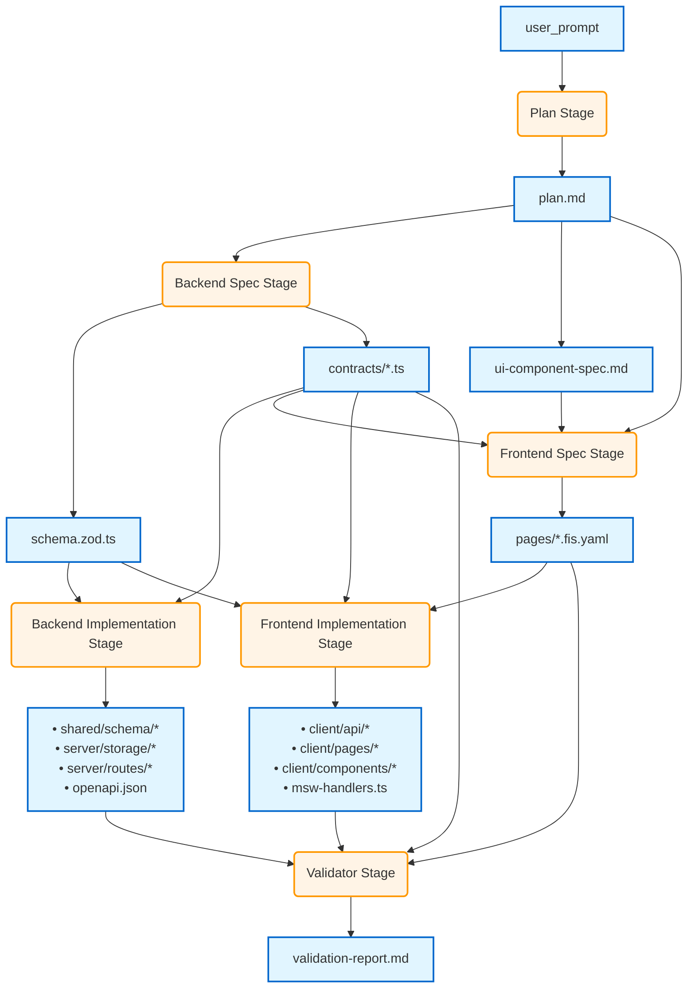

# Pipeline

## Executive Summary

The Leonardo App Factory pipeline that implements the "Holy Grail" architecture - a schema-first, contract-first
approach that enables fully autonomous app generation with compile-time type safety from database to UI.

## Current Pipeline

Artifacts are dependency nodes in a graph.
Stages are nodes in a graph that generate groups of artifacts.
Graphs are the most clear about the dependency aspect but can become large trying to show enough detail even with
subgraphs.
We can also flatten into a table, with sub-tables at independent/parallel points.

### Pipeline as Table

```
┌──────────────────────────────────────────────────────────────────────────────────────────────────────┐
│ Pipeline: Leonardo App Factory v2 - Holy Grail Architecture                                          │
├──────────────────────────────────────────────────────────────────────────────────────────────────────┤
│ Stage                    │ Artifacts In                      │ Artifacts Out                      │
├──────────────────────────┼───────────────────────────────────┼────────────────────────────────────┤
│ 1. Plan                  │ • user_prompt                     │ • plan.md                          │
│                          │   (app name, app description)     │                                    │
├──────────────────────────┼───────────────────────────────────┼────────────────────────────────────┤
│ 2. Backend Spec          │ • plan.md                         │ • schema.zod.ts                    │
│                          │                                   │ • contracts/*.ts                   │
├──────────────────────────┴───────────────────────────────────┴────────────────────────────────────┤
│ ⚡ PARALLELIZATION POINT: Backend and Frontend tracks can proceed independently                      │
├──────────────────────────┬───────────────────────────────────┬────────────────────────────────────┤
│ 3. Backend               │ • schema.zod.ts                   │ • shared/schema/*                  │
│    Implementation        │ • contracts/*.ts                  │ • server/storage/*                 │
│                          │                                   │ • server/routes/*                  │
│                          │                                   │ • generated/openapi.json           │
├──────────────────────────┼───────────────────────────────────┼────────────────────────────────────┤
│ 4. Frontend Spec         │ • plan.md                         │ • pages/*.fis.yaml                 │
│                          │ • contracts/*.ts                  │                                    │
│                          │ • ui-component-spec.md            │                                    │
├──────────────────────────┼───────────────────────────────────┼────────────────────────────────────┤
│ 5. Frontend              │ • pages/*.fis.yaml                │ • client/api/*                     │
│    Implementation        │ • contracts/*.ts                  │ • client/pages/*                   │
│                          │ • schema.zod.ts                   │ • client/components/*              │
│                          │                                   │ • generated/msw-handlers.ts        │
├──────────────────────────┴───────────────────────────────────┴────────────────────────────────────┤
│ ⚡ SYNC POINT: Backend and Frontend complete before validation                                       │
├──────────────────────────┬───────────────────────────────────┬────────────────────────────────────┤
│ 6. Validator             │ • app/*                           │ • validation-report.md             │
│                          │ • contracts/*.ts                  │                                    │
│                          │ • pages/*.fis.yaml                │                                    │
└──────────────────────────────────────────────────────────────────────────────────────────────────────┘
```

### Pipeline as Dependency Graph (Experimental)



## Stage Details

### Stage: Plan

**Purpose**: Convert user prompt into structured application plan

```
Input:  user_prompt
Agent:  plan_orchestrator
Output: plan/plan.md
```

### Stage: Backend Spec

**Purpose**: Define data models and API contracts as source of truth

```
Input:  plan/plan.md
Agents: schema_designer, contracts_designer
Output: specs/schema.zod.ts, specs/contracts/*.contract.ts
```

**Implementation Notes**:

- Zod schemas become single source of truth
- Contracts reference Zod schemas for type safety
- Both human and machine readable

### Stage: Backend Implementation

**Purpose**: Generate working backend from specifications

```
Input:  specs/schema.zod.ts, specs/contracts/*.ts
Agents: drizzle_schema_generator, storage_generator, ts_rest_contracts_generator, express_routes_generator
Output: app/shared/schema/tables.ts, app/server/storage/*, app/server/contracts/*, 
        app/server/routes/*, generated/openapi.json
```

**Implementation Notes**:

- Drizzle schemas derived from Zod using drizzle-zod
- Storage layer remains abstracted (MemStorage/PostgresStorage)
- Express routes use ts-rest for type safety
- OpenAPI generated automatically

### Stage: Frontend Spec

**Purpose**: Extend UI specs with data bindings

```
Input:  plan/plan.md, specs/contracts/*.ts, plan/ui-component-spec.md
Agent:  frontend_interaction_spec_generator
Output: specs/pages/*.fis.yaml
```

**Implementation Notes**:

- FIS binds UI components to API contracts
- Specifies TanStack Query hooks per component
- Defines data mutations and queries declaratively

### Stage: Frontend Implementation

**Purpose**: Generate type-safe frontend with data bindings

```
Input:  specs/pages/*.fis.yaml, specs/contracts/*.ts, specs/schema.zod.ts
Agents: api_hooks_generator, page_scaffolder, component_generator
Output: app/client/api/*, app/client/pages/*, app/client/components/*, generated/msw-handlers.ts
```

**Implementation Notes**:

- Auto-generated hooks from contracts
- Pages use hooks specified in FIS
- MSW handlers for development/testing
- No manual fetch() calls

### Stage: Validator

**Purpose**: Comprehensive validation of generated application

```
Input:  app/*, specs/contracts/*.ts, specs/pages/*.fis.yaml
Agent:  app_validator
Output: validation-report.md
```

**Implementation Notes**:

- Contract conformance testing
- FIS binding validation
- Type safety verification
- MSW mock testing
- End-to-end type checking

## Generated Application Structure

```
apps/[app-name]/
├── plan/
│   └── plan.md
├── specs/
│   ├── schema.zod.ts
│   ├── contracts/
│   │   ├── users.contract.ts
│   │   ├── workouts.contract.ts
│   │   └── ...
│   └── pages/
│       ├── home.fis.yaml
│       ├── workout-detail.fis.yaml
│       └── ...
├── app/
│   ├── shared/
│   │   ├── schema/
│   │   │   └── tables.ts
│   │   └── contracts/
│   ├── client/
│   │   ├── api/
│   │   ├── pages/
│   │   └── components/
│   └── server/
│       ├── storage/
│       │   ├── IStorage.ts
│       │   ├── MemStorage.ts
│       │   └── PostgresStorage.ts
│       ├── contracts/
│       └── routes/
└── generated/
    ├── openapi.json
    └── msw-handlers.ts
```