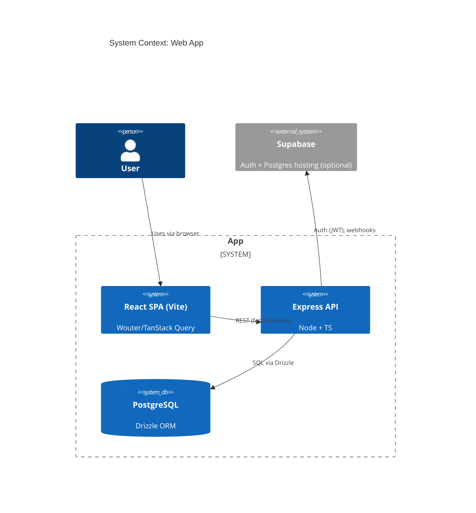
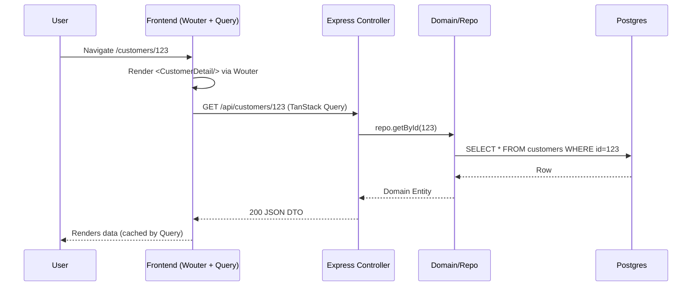
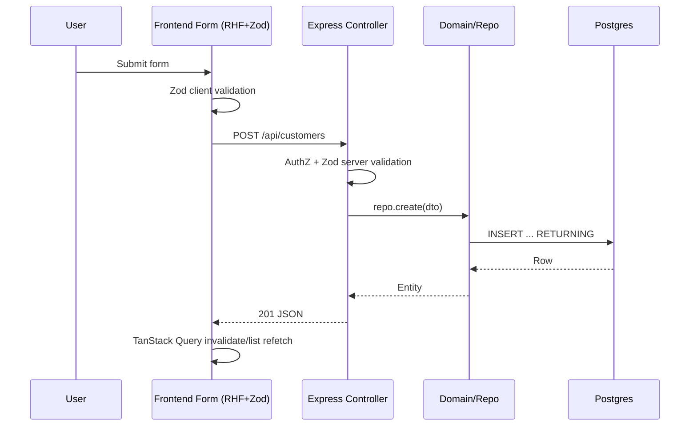
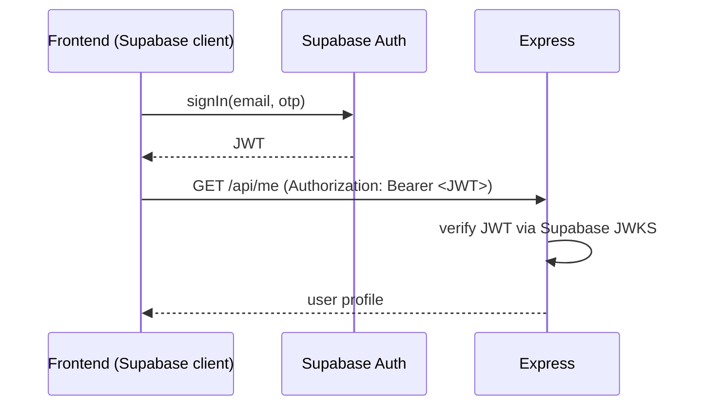
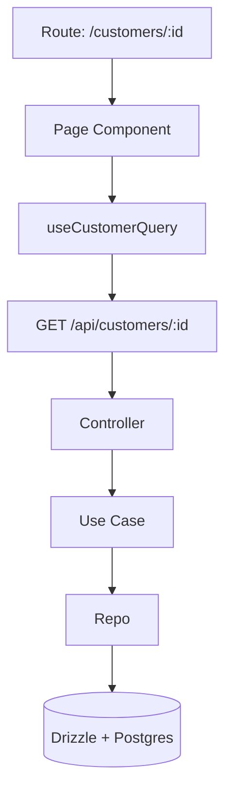

# Architecture & Terminology Guide

This document explains how the pieces of your stack fit together, clarifies overloaded terms like **routes**, and gives you domain‑oriented diagrams and recipes you can reuse.

---

## 1) The Big Picture

Think in **layers** rather than a single tree. Each layer has its own *routes*, *handlers*, and *models* — but they mean different things depending on the layer.

```
┌──────────────────────── Presentation (Frontend) ────────────────────────┐
│ React 18 + TS • Vite • Wouter • Tailwind • shadcn/ui                    │
│ UI components, client-side routes (URLs → pages), forms, validation     │
│ TanStack Query orchestrates server state (fetch/mutate/cache/sync)      │
└─────────────────────────────────────────────────────────────────────────┘
┌─────────────────────── Application (Backend API) ───────────────────────┐
│ Node + TS + Express • REST endpoints • Auth middleware (Supabase)       │
│ Request/response mapping, input validation, orchestration of use cases  │
└─────────────────────────────────────────────────────────────────────────┘
┌────────────────────────── Domain (Business) ────────────────────────────┐
│ Entities, Value Objects, Domain Services, Use Cases (CRUD+rules)        │
│ Technology‑agnostic logic (e.g., Invoice, User, Integration)            │
└─────────────────────────────────────────────────────────────────────────┘
┌──────────────────────── Infrastructure (Data) ──────────────────────────┐
│ PostgreSQL • Drizzle ORM • Storage adapters (MemStorage/PostgresStorage)│
│ Schema-first, Migrations, Repositories, External integrations           │
└─────────────────────────────────────────────────────────────────────────┘
```

> **Key idea:** Your *URLs on the frontend* are **client routes**. Your *API paths on the server* are **endpoint routes**. They’re different, but the client routes usually **call** the endpoint routes.

---

## 2) Clarifying “Routes” (Client vs. Server)

**Client routes (Wouter)**
- Map a browser URL → a React page/screen (component tree).
- Never touch the database. They render UI and **invoke** API calls.
- Examples: `/dashboard`, `/customers/:id`, `/settings/security`.

**Server routes (Express)**
- Map an HTTP method + path → controller/handler.
- Run business logic (use cases), touch repositories, enforce auth.
- Examples: `GET /api/customers/:id`, `POST /api/integrations`, `PATCH /api/users/:id`.

**How they relate**
- Page route `/customers/123` renders `<CustomerDetail />` → TanStack Query fetches `GET /api/customers/123` → server handler loads from Postgres via Drizzle → returns JSON.

### Mapping table
| Concept | Frontend (Wouter) | Backend (Express) |
|---|---|---|
| URL shape | `/customers/:id` | `/api/customers/:id` |
| Trigger | User navigation | HTTP request |
| Unit | Page/Screen | Endpoint/Controller |
| State | UI + client cache | DB + domain entities |

---

## 3) C4‑style System & Component Views

### 3.1 Context (C4 Level 1)


### 3.2 Container/Component (C4 Level 2–3)
```mermaid
flowchart LR
  subgraph Frontend [React App]
    Router[Wouter Router]
    Pages[Page Components]
    Forms[react-hook-form + Zod]
    Query[TanStack Query]
    UI[shadcn/ui + Tailwind]
  end

  subgraph Backend [Express API]
    MW[Auth & Validation Middleware]
    C[Controllers]
    UC[Use Cases (Domain Services)]
    Repo[Repositories]
  end

  subgraph Data [Infrastructure]
    Drizzle[Drizzle ORM]
    PG[(PostgreSQL)]
    Mem[MemStorage (dev)]
  end

  Router --> Pages
  Pages --> Forms
  Pages --> Query
  Query <---> C
  C --> MW
  C --> UC
  UC --> Repo
  Repo --> Drizzle
  Drizzle --> PG
  Repo --> Mem
```

---

## 4) Domain‑First Structure (what your “tree” should represent)

Model each **bounded context** (domain area) as a vertical slice that spans all layers.

```
/ src
  / customer
    / ui           # React pages & components for this domain
    / api          # client-side API hooks (TanStack Query)
    / application  # server controllers for customer endpoints
    / domain       # entities/value objects/use cases (pure TS)
    / infra        # repositories, Drizzle schemas, mappers
  / integration
  / auth
  / shared         # cross-cutting utils, types, design system
```

**Why:** This keeps *UI, endpoint, domain logic, and data access* for a concept (e.g., Customer) next to each other, making the mental model a **vertical slice**, not a flat tree by layer.

---

## 5) Where the Data Model Fits

- **Schema-first**: Define **Drizzle** schema (tables/relations) first; generate migrations.
- **Domain entities**: Wrap raw rows in domain types/classes (e.g., `Customer` with invariants). Avoid leaking table shapes across layers.
- **Repositories**: Hide Drizzle/SQL. Expose methods like `getById`, `create`, `listByStatus`.
- **DTOs**: Controllers map entity ↔ DTOs for the API.

```ts
// Example (simplified)
// infra/schema.ts (Drizzle)
export const customers = pgTable('customers', {
  id: uuid('id').primaryKey(),
  name: text('name').notNull(),
  email: text('email').notNull().unique(),
  createdAt: timestamp('created_at').defaultNow(),
});

// domain/customer.ts
export type Customer = Readonly<{ id: string; name: string; email: string }>

// infra/repo.ts
export class CustomerRepo { /* drizzle queries here */ }

// application/controller.ts (Express)
app.get('/api/customers/:id', async (req, res) => { /* use repo */ })
```

---

## 6) Typical Request Lifecycles

### 6.1 Page navigation → data fetch (read)


### 6.2 Form submit → mutation (write)


---

## 7) Supabase Auth in This Architecture

- **Frontend**: Use Supabase client to sign in/out and get a **JWT**.
- **Backend**: Validate Supabase JWT in Express middleware (verify signature & claims). Attach `req.user`.
- **DB**: If using Supabase‑hosted Postgres, Drizzle connects to the DB; you can still keep **row‑level security (RLS)** off in Express mode, or on if you proxy with service role. Pick one auth enforcement point: usually **Express middleware + domain rules**.



**Tip:** For local dev, use Supabase local stack or mock: accept `Authorization: Bearer dev-<userId>` plus a dev guard.

---

## 8) TanStack Query: your "server state" brain

- **Fetching**: `useQuery(['customer', id], fetcher)`—cache by key; background refetch.
- **Mutations**: `useMutation(createCustomer, { onSuccess: invalidate(['customers']) })`.
- **De‑duplication**: parallel requests collapse.
- **Retry & staleTime**: tune per endpoint.

**Pattern:** Put all query/mutation hooks in the domain slice (`/customer/api`) to keep UI clean.

---

## 9) Validation: client + server

- **Client**: `react-hook-form` + **Zod** schema for instant feedback.
- **Server**: Reuse the same Zod schema (via a shared package) inside Express controllers. Always treat server as source of truth.

```ts
// shared/validation/customer.ts
export const CustomerCreate = z.object({ name: z.string().min(1), email: z.string().email() })
```

---

## 10) Single Port Architecture (dev & prod)

- **Dev**: Vite runs at `:5173`, proxies `/api/*` → Express at `:5000`.
- **Prod**: Express serves the built React app **and** the API from **:5000**.

```txt
Browser ──▶ :5173 (Vite) ──proxy /api──▶ :5000 (Express) ──▶ Postgres
Browser ──▶ :5000 (Express static + API) ───────────────▶ Postgres
```

---

## 11) Suggested Folder Layouts

### Frontend (vite + wouter)
```
/src
  /app
    main.tsx
    router.tsx        # Wouter route table
    providers.tsx     # QueryClient, Theme, etc.
  /customer
    /ui               # pages/components
    /api              # useCustomerQuery/useCreateCustomer
    /validation       # zod schemas
  /shared             # lib, hooks, ui wrappers
```

### Backend (express + drizzle)
```
/src
  /customer
    application/      # controllers
    domain/           # entities/use-cases
    infra/            # drizzle schemas + repos
  /auth               # JWT middleware
  /shared             # zod, errors, result helpers
  server.ts           # express app
```

---

## 12) Naming Conventions (to reduce confusion)

- **Routes**
  - Client: `router.tsx` → `path` → `Page` (e.g., `/customers/:id` → `CustomerDetailPage`).
  - Server: `routes.ts` → `method path` → `Controller` (e.g., `GET /api/customers/:id` → `getCustomer`).
- **DTOs vs Entities**: `CustomerDTO` for JSON over the wire, `Customer` for domain.
- **Repositories**: `CustomerRepo` with verbs: `getById`, `create`, `update`, `delete`, `search`.

---

## 13) Glossary (quick answers)

- **Client route**: URL → React component. *Pages*, not endpoints.
- **Endpoint route**: HTTP method+path → Express handler. *Endpoints*.
- **Domain model**: Concepts & rules (entities, value objects, services).
- **Data model**: Tables/columns (Drizzle schema) that persist the domain.
- **Integration**: An external system boundary (e.g., Supabase auth, webhook provider). Wrap in infra adapters.
- **CRUD vs Business Logic**: CRUD is persistence operations; business logic is invariants, workflows, policies.

---

## 14) Example: End‑to‑End Slice (Customer)

- **Client route**: `/customers/:id` → `CustomerDetailPage` → `useCustomerQuery(id)`.
- **Server route**: `GET /api/customers/:id` → `getCustomerController`.
- **Domain**: `Customer` entity, rules (e.g., email uniqueness).
- **Data**: `customers` table, `CustomerRepo`.



---

## 15) Dev Tooling Notes

- **OXC** for linting (fast) + TypeScript strict mode.
- **Single process**: run Express; in prod it serves static React build and API on `:5000`.
- **MemStorage**: swap `Repo` implementation with in‑memory map for fast local dev & tests.

---

## 16) Checklists

**Create a new domain slice**
- [ ] Define Drizzle schema + migration
- [ ] Model domain entity & invariants
- [ ] Write repository with typed queries
- [ ] Expose use cases (services)
- [ ] Add Express routes/controllers w/ Zod validation
- [ ] Add frontend query/mutation hooks
- [ ] Add Wouter route + page
- [ ] Wire forms (RHF+Zod) & optimistic UX

**Add a new endpoint**
- [ ] Define DTO & Zod schema
- [ ] Implement controller + use case
- [ ] Unit test domain/repo
- [ ] Add client hook + invalidate keys
- [ ] Document in API mdx/Swagger (optional)

---

## 17) FAQ

**Q: Is this a tree?**  
A: The *domain* can be pictured as a tree (Integration → Database → Tables → CRUD), but the whole system is better seen as **vertical slices** spanning UI→API→Domain→Data. Trees inside slices; **rails** between layers.

**Q: Where does the data model fit?**  
A: In **infrastructure** (Drizzle schema + Postgres). It backs the **domain model**, which is the language of your business rules.

**Q: Routes to pages or endpoints?**  
A: Both exist, in different layers. Client routes → pages. Server routes → endpoints. Pages *call* endpoints.

---

## 18) Next Steps

- Adopt the folder templates above and migrate one slice (e.g., `customer`).
- Introduce an `auth` slice: Supabase middleware + `useSession()` provider.
- Add a lightweight ADR documenting the chosen Single Port + Supabase JWT strategy.

