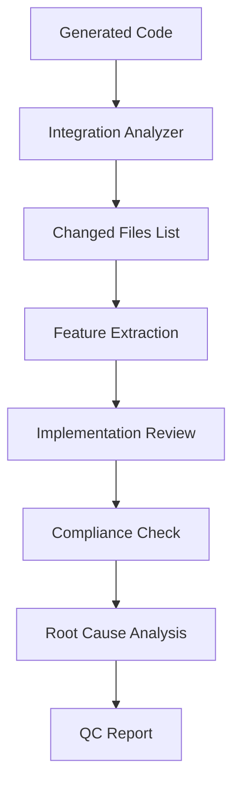

# QC System and Validation Mechanisms

## Overview

The Quality Control (QC) system is the guardian of quality in the AI App Factory. It ensures that generated applications meet specifications, follow best practices, and maintain professional standards through multi-layer validation.

## Core Philosophy

**"Trust, but Verify"** - While we trust our generator agents to produce quality code, we systematically verify that all requirements are met and standards are maintained.

## Multi-Layer Validation Architecture

```
┌─────────────────┐
│ Specification   │ → Validates requirements coverage
├─────────────────┤
│ Build-Time      │ → Catches syntax and type errors  
├─────────────────┤
│ Runtime         │ → Detects execution issues
├─────────────────┤
│ Compliance      │ → Ensures pattern adherence
└─────────────────┘
```

## The QC Agent

### Purpose
The QC Agent validates that generated code correctly implements all specified features while adhering to technical patterns and best practices.

### Key Innovation: Integration Analyzer

**Problem**: Reviewing 100+ generated files is inefficient and often exceeds token limits.

**Solution**: The `integration_analyzer` tool compares generated code against a base template to identify only changed files.

**Impact**:
- **90%+ scope reduction**: Review 10 files instead of 100
- **Token efficiency**: Stay within LLM constraints
- **Focused analysis**: Concentrate on actual implementation
- **Faster processing**: Complete reviews in minutes

**Usage**:
```bash
integration_analyzer --base template/ --target generated/
# Output: List of added/modified files only
```

### QC Process Flow



### Detailed QC Steps

#### 1. Scope Analysis
```python
# Identify files to review
changed_files = integration_analyzer(
    base="base_template/",
    target="generated_app/"
)
# Result: ["src/app/dashboard/page.tsx", "src/components/Chat.tsx", ...]
```

#### 2. Feature Extraction
Parse the interaction specification to create a comprehensive checklist:
```markdown
## Required Features Checklist
- [ ] User Authentication
  - [ ] Login form with email/password
  - [ ] Logout functionality
  - [ ] Session persistence
- [ ] Channel Management  
  - [ ] Create channel modal
  - [ ] Channel list sidebar
  - [ ] Channel switching
```

#### 3. Implementation Review
For each changed file, verify feature implementation:
```typescript
// ✅ FOUND: Login form in src/app/login/page.tsx
<form onSubmit={handleLogin}>
  <Input type="email" name="email" required />
  <Input type="password" name="password" required />
  <Button type="submit">Login</Button>
</form>

// ❌ MISSING: Password reset link
// Expected: Link to password reset flow
```

#### 4. Technical Pattern Compliance
Verify adherence to standardized patterns:
```typescript
// ✅ Correct token storage pattern
localStorage.setItem('auth_token', token);

// ❌ Wrong key used
localStorage.setItem('token', token); // Should be 'auth_token'
```

#### 5. Root Cause Analysis
Categorize why features are missing or incorrect:

**Categories**:
- **Specification Issues** (30%): Ambiguous or incomplete requirements
- **Implementation Issues** (50%): Overlooked or misunderstood features  
- **Complexity Issues** (15%): Technical challenges or time constraints
- **Enhancement Opportunities** (5%): Agent added helpful features

#### 6. Report Generation
Produce structured, actionable reports:

```markdown
# QC Report: Slack Clone

## Executive Summary
- **Compliance Score**: 85%
- **Missing Features**: 12
- **Extra Features**: 2
- **Build Status**: ✅ Pass
- **Runtime Status**: ✅ No errors

## Scope Analysis
- **Total Files**: 105
- **Files Reviewed**: 10
- **Scope Reduction**: 90.5%
- **Review Time**: 4 minutes

## Compliance Details

### ✅ Correctly Implemented (45/53)
1. **User Authentication** 
   - Login form with validation
   - Secure token storage
   - Protected route implementation
   
2. **Channel Management**
   - Channel creation modal
   - Channel list with active state
   - Real-time channel switching

### ❌ Missing Features (12)
1. **Thread Replies** [Priority: High]
   - **Expected**: Reply button on each message
   - **Found**: No thread UI implementation
   - **Location**: `src/components/MessageList.tsx`
   - **Root Cause**: Implementation complexity
   - **Fix**: Add Thread component and reply logic

2. **File Uploads** [Priority: Medium]
   - **Expected**: Attachment button in message composer
   - **Found**: Text-only messages
   - **Location**: `src/components/MessageComposer.tsx`
   - **Root Cause**: Specification marked as "future enhancement"

### ➕ Extra Features (2)
1. **Auto-save Draft Messages**
   - **Description**: Saves message drafts to localStorage
   - **Benefit**: Prevents data loss on refresh
   - **Decision**: Keep - improves UX

### 🔧 Technical Pattern Compliance
- ✅ Authentication patterns followed correctly
- ✅ Error handling implemented consistently
- ⚠️ Missing loading states in 3 components
- ✅ API client pattern implemented properly

## Recommendations
1. **Immediate**: Implement missing thread UI
2. **Next Sprint**: Add file upload capability
3. **Future**: Consider the agent's draft auto-save pattern for standard inclusion
```

## Validation Tools and Mechanisms

### 1. Build-Time Validation

**Tool**: `build_test` MCP tool

**Capabilities**:
- TypeScript compilation checking
- ESLint rule enforcement
- Next.js build verification
- Dependency resolution
- Import validation

**Usage**:
```bash
build_test verify
# Runs: npm run build && npm run lint && npm run type-check
```

**Common Catches**:
- Type errors
- Missing imports
- Undefined variables
- Syntax errors
- Circular dependencies

### 2. Runtime Validation

**Tool**: `browser` MCP tool

**Capabilities**:
- JavaScript execution testing
- Console error detection
- Network request monitoring
- Visual regression testing (screenshots)
- Performance metrics

**Usage**:
```python
# Test specific flows
browser.navigate("/login")
browser.fill_form({"email": "test@example.com", "password": "test123"})
browser.click("button[type='submit']")
errors = browser.get_console_errors()
```

**Common Catches**:
- Null reference errors
- API integration issues
- State management bugs
- Event handler errors
- Memory leaks

### 3. Specification Validation

**Tool**: Structured checklists and feature mapping

**Process**:
1. Extract all features from specification
2. Map features to expected file locations
3. Verify each feature is implemented
4. Check for feature completeness

**Example Checklist**:
```yaml
authentication:
  login:
    - form_exists: true
    - email_validation: true
    - password_validation: true
    - error_handling: true
    - success_redirect: true
  logout:
    - button_exists: true
    - token_cleanup: true
    - redirect_to_login: true
```

### 4. Pattern Compliance Validation

**Standardized Patterns Checked**:

```typescript
// Authentication Pattern
const AUTH_PATTERNS = {
  tokenKeys: ['auth_token', 'refresh_token'],
  storageMethod: 'localStorage',
  headerFormat: 'Bearer {token}',
  logoutBehavior: 'hard_refresh'
};

// Error Handling Pattern  
const ERROR_PATTERNS = {
  httpCodes: [400, 401, 403, 404, 429, 500],
  userNotification: 'toast',
  logging: 'console.error',
  fallbackBehavior: 'show_error_page'
};

// API Client Pattern
const API_PATTERNS = {
  singleton: true,
  autoAuth: true,
  errorInterceptor: true,
  retryLogic: true
};
```

## Validation Gates

### Stage Gates
Each pipeline stage has exit criteria that must be met:

```yaml
stage_2_exit_criteria:
  build_passes: true
  no_runtime_errors: true
  compliance_score: ">= 80%"
  critical_features: "100%"
  
stage_3_exit_criteria:
  api_contract_complete: true
  data_models_defined: true
  backend_frontend_alignment: true
```

### Continuous Validation
Validation continues throughout the pipeline:

1. **Pre-Generation**: Validate specifications are complete
2. **During Generation**: Incremental validation of outputs
3. **Post-Generation**: Comprehensive validation suite
4. **Pre-Deployment**: Final safety checks

## Quality Metrics

### Compliance Scoring

```python
def calculate_compliance_score(features):
    total = len(features.required)
    implemented = len(features.implemented)
    score = (implemented / total) * 100
    
    # Adjust for critical features
    critical_complete = all(f.implemented for f in features.critical)
    if not critical_complete:
        score = min(score, 70)  # Cap at 70% if missing critical
        
    return score
```

### Quality Dimensions

1. **Feature Completeness**: % of required features implemented
2. **Pattern Adherence**: % following standard patterns
3. **Code Quality**: Linting score, type safety
4. **Performance**: Load time, bundle size
5. **Accessibility**: WCAG compliance score
6. **Security**: Authentication, XSS prevention

## Self-Improvement Through QC

### Learning from QC Reports

QC reports feed into the self-improvement system:

```json
{
  "patterns_identified": [
    {
      "pattern": "missing_password_reset",
      "frequency": 8,
      "apps": ["slack-clone", "trello-clone", "jira-clone"],
      "recommendation": "Add to standard auth requirements"
    }
  ],
  "common_root_causes": [
    {
      "cause": "ambiguous_realtime_requirements",
      "occurrences": 12,
      "solution": "Clarify websocket vs polling in specs"
    }
  ]
}
```

### Continuous Improvement Cycle

```
QC Reports → Pattern Analysis → Prompt Updates → Better Generation
     ↑                                                    ↓
     ←────────────── Measure Improvement ←───────────────
```

## Best Practices

### 1. Early Validation
- Validate specifications before generation
- Check dependencies before building
- Verify patterns during development

### 2. Comprehensive Coverage
- Test happy paths and edge cases
- Validate both positive and negative scenarios
- Check accessibility and security

### 3. Actionable Feedback
- Provide specific file locations
- Include code examples
- Suggest concrete fixes

### 4. Balanced Reporting
- Acknowledge what works well
- Focus on critical issues first
- Separate must-fix from nice-to-have

### 5. Continuous Learning
- Track patterns across projects
- Update validation rules based on findings
- Share learnings across agents

## Future Enhancements

### Planned Improvements

1. **Visual Regression Testing**: Automated screenshot comparison
2. **Performance Budgets**: Automatic performance validation
3. **Accessibility Scanning**: Automated WCAG compliance
4. **Security Scanning**: Vulnerability detection
5. **API Contract Testing**: Automatic contract validation

### Advanced QC Patterns

1. **Predictive QC**: Identify likely issues before generation
2. **Adaptive Thresholds**: Adjust quality gates based on app type
3. **Cross-Stage Validation**: Ensure consistency across pipeline
4. **User Acceptance Simulation**: AI-driven user journey testing

## Conclusion

The QC system is essential for maintaining quality at scale. By combining automated validation tools with intelligent analysis, we ensure that every generated application meets professional standards while continuously improving the system's capabilities.

The integration analyzer innovation demonstrates how thoughtful tooling can dramatically improve efficiency without sacrificing thoroughness—a pattern we'll continue to apply throughout the system.