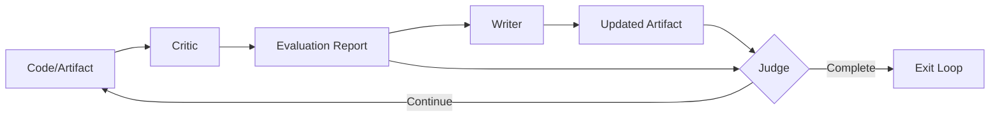
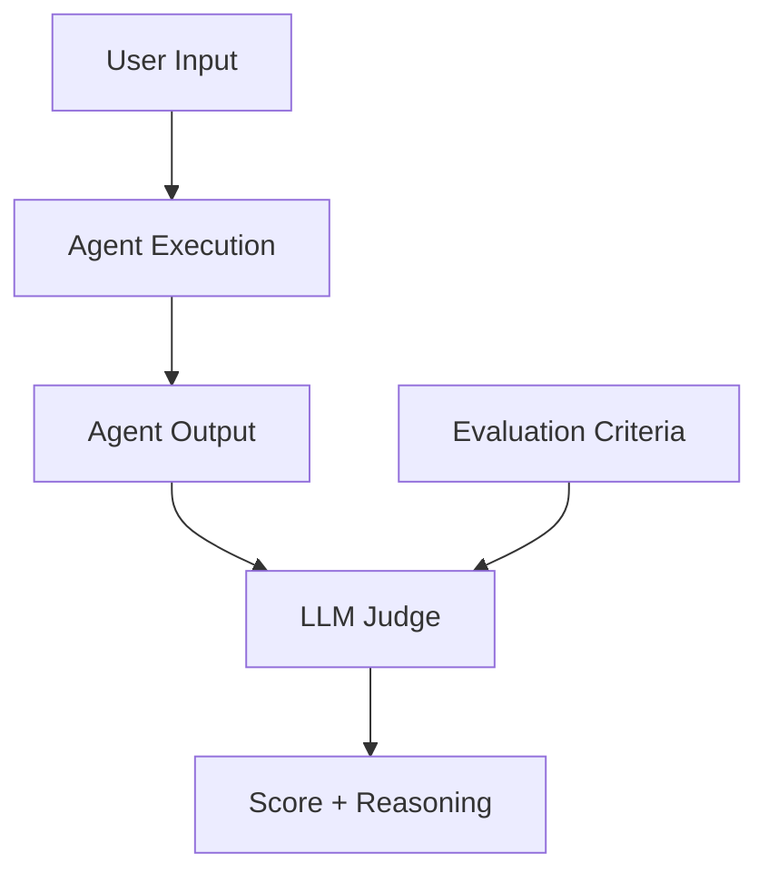
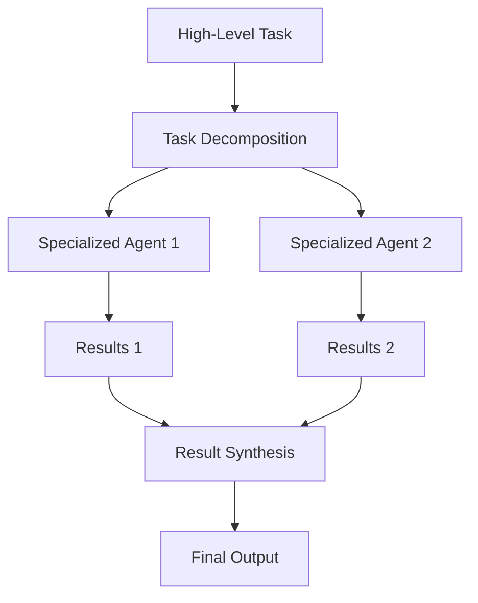

# Agentic AI Patterns

This document defines reusable patterns for building effective agentic AI systems, backed by research and proven practices.

## Core Pattern: Critic-Writer-Judge

The Critic-Writer-Judge pattern is a fundamental approach for iterative improvement in multi-agent systems.

### Pattern Components

**1. Critic (Evaluator)**
- Analyzes current artifact against specific criteria
- Produces detailed evaluation report
- Maintains single focus (e.g., spec compliance OR code quality)
- Does not make changes, only identifies issues

**2. Writer (Developer)**
- Receives evaluation report
- Makes targeted improvements
- Maintains artifact integrity
- Focuses on addressing specific feedback

**3. Judge (Decision Maker)**
- Evaluates BOTH the critic's report AND the updated artifact
- Makes go/no-go decisions based on:
  - Convergence criteria
  - Quality thresholds
  - Resource constraints
- Provides transparency in decision rationale

### Why This Pattern Works

1. **Full Context Decision Making**: Judge has access to both analysis and artifact
2. **Separation of Concerns**: Each role has a focused responsibility
3. **Prevents Rubber Stamping**: Judge independently verifies claims
4. **Scalable Evaluation**: Can handle complex, nuanced assessments

## LLM-as-Judge Evaluation Pattern

Based on current research, LLM-as-Judge is becoming the standard for evaluating AI agent outputs.

### Key Principles

1. **Comprehensive Input**
   - Judge needs access to original requirements
   - Must see both evaluation criteria and actual output
   - Benefits from seeing the evaluation report AND the artifact

2. **Transparent Reasoning**
   - Judges should document their evaluation process
   - Explicitly outline criteria used
   - Provide scores with justification

3. **Rubric-Based Evaluation**
   - Factual accuracy
   - Completeness
   - Quality metrics
   - Efficiency measures

### Implementation Guidelines

## Multi-Agent Information Flow

Effective multi-agent systems require careful management of information flow and artifacts.

### Artifact Management Patterns

1. **Hierarchical Flow**
   - Parent agents decompose tasks
   - Child agents execute subtasks
   - Results bubble up with context preservation

2. **State Propagation**
   - Changes in one agent's context propagate to relevant agents
   - Shared memory or message passing
   - Versioning for artifact changes

3. **Integration Bus Pattern**
   - Central hub manages information flow
   - Ensures cohesive data exchange
   - Prevents information silos

### Communication Patterns

## Emergent Behavior Considerations

Multi-agent systems exhibit emergent behaviors that require special attention:

1. **Small Changes, Big Effects**
   - Minor prompt changes can dramatically alter system behavior
   - Test changes with small samples first
   - Monitor downstream effects

2. **Interaction Patterns**
   - Success depends on understanding agent interactions
   - Not just individual agent performance
   - Design for predictable communication

3. **Feedback Loops**
   - Positive feedback can amplify good patterns
   - Negative feedback can create deadlocks
   - Design circuit breakers for runaway loops

## Best Practices for Agentic Systems

### 1. Start Simple, Iterate
- Begin with basic agent interactions
- Add complexity only when needed
- Test each addition thoroughly

### 2. Explicit Over Implicit
- Document all agent capabilities
- Make decision criteria transparent
- Avoid hidden dependencies

### 3. Evaluation First
- Design evaluation before implementation
- Use multiple evaluation perspectives
- Automate where possible

### 4. Resource Awareness
- Set iteration limits
- Monitor token/compute usage
- Design for graceful degradation

### 5. Human-in-the-Loop Options
- Allow for human intervention
- Design override mechanisms
- Maintain audit trails

## Pattern Selection Guide

Choose patterns based on your use case:

| Use Case | Recommended Pattern | Key Consideration |
|----------|-------------------|-------------------|
| Code Quality | Critic-Writer-Judge | Multiple evaluation criteria |
| Content Generation | Writer-Critic-Judge | Creative freedom with guardrails |
| Validation | Critic-Judge | No modification needed |
| Complex Decisions | Multi-Critic-Judge | Multiple perspectives required |

## References

- LLM-as-Judge evaluation frameworks
- Multi-agent system architectures
- Emergent behavior in AI systems
- Software development best practices adapted for AI