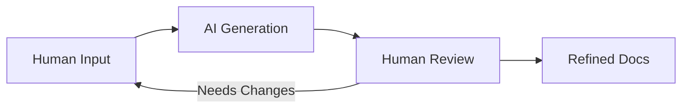

# Documentation Process: Human Input → AI Generation

This document describes the process for creating comprehensive documentation through human-AI collaboration.

## Overview

The process enables efficient documentation creation by:
1. Humans provide concise, structured input
2. AI expands into detailed documentation
3. Results feed into refined documentation

## Process Flow



## Directory Structure

```
docs/
├── human-input/      # Concise human-provided outlines
├── ai-generated/     # AI-expanded documentation
└── refined/          # Final reviewed documentation
```

## Human Input Format

### Principles
- **Extreme conciseness**: Facts only, no explanations
- **Structured format**: Consistent patterns
- **Complete information**: All key data points
- **Tool focus**: Specific tool names/references

### Template Structure

```markdown
# [Stage/Component Name]

(very concise! human input, ai-aided)

## Phase N: [Phase Name]
Pattern: [Agent Pattern]

Step Type: [Writer/Critic/Judge]
Purpose: [One line description]
Inputs: [Comma-separated list]
Outputs: [Comma-separated list]
Tools: [tool_name, tool_name]
```

### Example Human Input

```markdown
# Authentication Module

## Phase 1: Implementation
Pattern: Writer

Step Type: Writer
Purpose: Create auth endpoints and middleware
Inputs: Auth Spec, Security Requirements
Outputs: Auth Code, Test Suite
Tools: fastapi, pytest, jwt_encoder
```

## AI Generation Guidelines

### Expansion Rules
1. **Preserve Structure**: Maintain the original organization
2. **Add Context**: Explain the "why" behind each element
3. **Detail Inputs/Outputs**: Describe format, schema, validation
4. **Tool Usage**: Explain how each tool is used
5. **Success Criteria**: Add measurable outcomes
6. **Common Patterns**: Include typical scenarios

### Standard Sections to Add
- Overview paragraph
- Detailed purpose explanation
- Input/Output specifications
- Tool usage patterns
- Success criteria
- Common issues and solutions
- Optimization tips

### Generation Prompt Template

```
Based on the concise human input, generate a detailed workflow document that:
1. Expands each phase with comprehensive explanations
2. Details all inputs/outputs with schemas where applicable
3. Explains tool usage and best practices
4. Adds success criteria and metrics
5. Includes common patterns and anti-patterns
6. Maintains clear, scannable structure
```

## Review and Refinement

### Review Checklist
- [ ] Technical accuracy verified
- [ ] All expansions align with project standards
- [ ] No hallucinated tools or processes
- [ ] Consistent terminology used
- [ ] Links to related docs added

### Integration Steps
1. Review AI-generated content for accuracy
2. Extract reusable patterns for pattern library
3. Update refined docs with verified content
4. Cross-reference with existing documentation
5. Archive superseded versions

## Benefits

### For Humans
- Minimal time investment
- Focus on structure, not prose
- Consistent documentation
- Easy to maintain

### For AI
- Clear structure to follow
- Unambiguous input
- Consistent expansion patterns
- Predictable output quality

## Best Practices

### DO
- Keep human input extremely concise
- Use consistent formatting
- Include all essential information
- Review AI output before using
- Maintain version history

### DON'T
- Add explanations in human input
- Skip the review process
- Mix formats within a document
- Assume AI output is perfect
- Delete human input files

## Example Workflow

1. **Human Creates Input** (5 minutes)
   ```
   vim human-input/new-feature-workflow.md
   # Add concise structured content
   ```

2. **AI Generates Detailed Doc** (1 minute)
   ```
   # Use AI to expand into ai-generated/new-feature-workflow-detailed.md
   ```

3. **Human Reviews** (5 minutes)
   - Verify technical accuracy
   - Check tool names
   - Ensure consistency

4. **Update Refined Docs** (5 minutes)
   - Integrate verified content
   - Update cross-references
   - Commit changes

Total time: ~16 minutes for comprehensive documentation

## Metrics for Success

- Time saved: 70%+ vs traditional documentation
- Consistency: 95%+ format compliance
- Completeness: All sections populated
- Accuracy: Technical review pass rate >90%
- Maintenance: Update time <20% of original

## Future Enhancements

1. **Automation**: Script the generation process
2. **Templates**: More domain-specific templates
3. **Validation**: Automated accuracy checks
4. **Integration**: Direct IDE integration
5. **Versioning**: Automatic change tracking