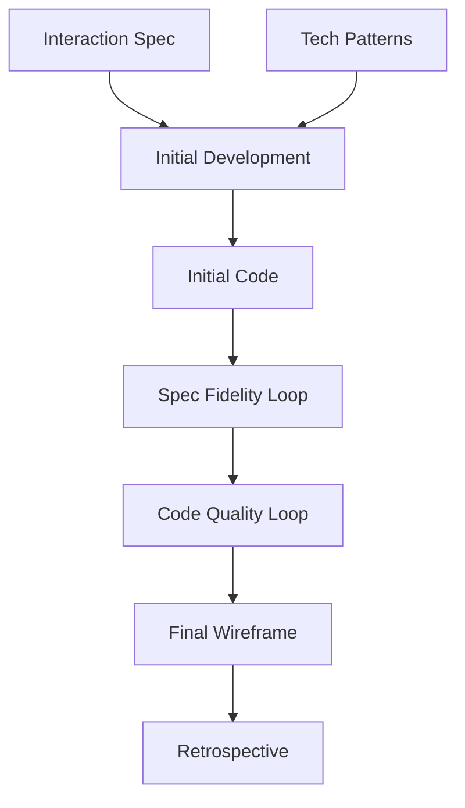
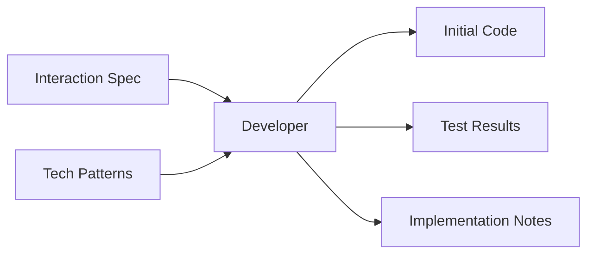
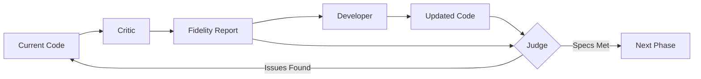
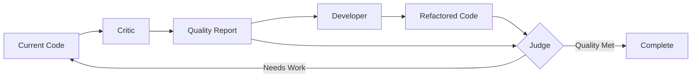
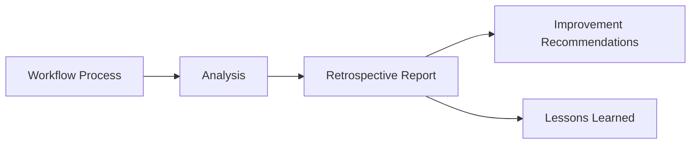
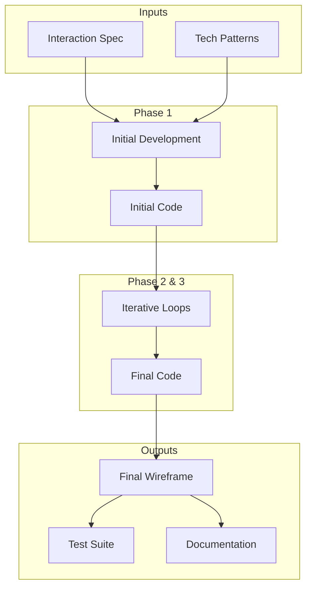

# Stage 2: Wireframe Generation Workflow

## Overview

Transform interaction specifications into a fully functional Next.js wireframe using the [Critic-Writer-Judge pattern](./agentic-patterns.md#core-pattern-critic-writer-judge).

## Stage Flow

## Phase 1: Initial Creation

Create baseline implementation from specifications.

## Phase 2: Spec Fidelity Loop

Ensure implementation matches specifications exactly.

**Focus**: Feature completeness, behavior accuracy, edge case handling

## Phase 3: Code Quality Loop

Ensure code is maintainable and follows best practices.

**Focus**: Code patterns, simplicity, maintainability, performance

## Phase 4: Retrospective

Analyze and improve the workflow process.

## Decision Criteria

### Judge Evaluation Points

1. **Spec Fidelity Judge**
   - Inputs: Fidelity report + Updated code
   - Evaluates: Feature implementation, behavior matching, edge cases
   - Decision: Continue iteration or proceed to quality phase

2. **Code Quality Judge**
   - Inputs: Quality report + Refactored code
   - Evaluates: Best practices, maintainability, simplicity
   - Decision: Continue iteration or mark complete

### Exit Conditions

- Maximum iterations reached (configurable)
- All critical requirements met
- Diminishing returns detected
- Resource limits reached

## Artifact Flow Summary

## Success Metrics

- Spec compliance: >95%
- Code quality score: >85%
- Test coverage: >80%
- Iteration efficiency: <5 loops per phase
- Time to completion: Within sprint bounds

## See Also

- [Agentic Patterns](./agentic-patterns.md) - Pattern definitions and theory
- [Stage 2 Design Decisions](./stage-2-design-decisions.md) - Rationale for this implementation
- [Step Details Template](./step-details-template.md) - Detailed step documentation