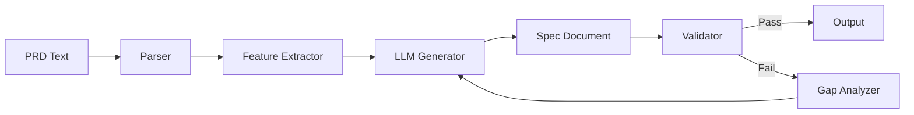

# Frontend Interaction Spec Generator Tools

## Required Capabilities

The Frontend Interaction Spec Generator is primarily a text transformation task, requiring:

### 1. Natural Language Understanding
- Parse and comprehend business requirements
- Extract functional requirements from prose
- Identify implicit requirements

### 2. Structured Output Generation
- Generate well-formatted Markdown
- Create consistent YAML-like structures
- Maintain proper hierarchy and organization

### 3. Pattern Recognition
- Identify common application patterns
- Recognize CRUD operations
- Detect authentication needs

## Tools Needed

### Core Tools

**1. Text Generation Model**
- High-quality language model (Claude, GPT-4, etc.)
- Capable of structured output
- Good at following detailed instructions

**2. Markdown Formatter**
- Ensure consistent formatting
- Proper heading hierarchy
- Code block formatting

### Optional Enhancement Tools

**1. PRD Parser**
- Extract key features automatically
- Identify user personas
- List functional requirements

**2. Checklist Validator**
- Verify all PRD features mapped
- Check for standard patterns
- Identify missing interactions

**3. Example Library**
- Common interaction patterns
- Standard flow templates
- Industry best practices

## Tool Configuration

### LLM Configuration
```yaml
model: claude-3-opus-20240229  # or gpt-4
temperature: 0.3  # Lower for consistency
max_tokens: 8000  # Specs can be lengthy
system_prompt: |
  You are an expert UX designer creating interaction specifications.
  Be thorough, specific, and cover all edge cases.
```

### Output Formatting
```yaml
format: markdown
sections:
  - overview
  - global_navigation
  - pages
  - user_flows  
  - state_management
  - error_handling
  - validation_checklist
```

## Integration Points

### Input Processing
1. Receive PRD as structured text
2. Parse into feature list
3. Identify user types and permissions
4. Extract business rules

### Output Generation
1. Generate specification following template
2. Ensure all sections populated
3. Validate completeness
4. Format for next stage

## Quality Assurance Tools

### Coverage Analyzer
Checks that specification includes:
- All PRD features
- Standard patterns
- Error states
- Navigation paths

### Interaction Validator
Ensures each interaction has:
- Trigger defined
- Action specified
- Feedback described
- Error handling

### Flow Completeness Checker
Verifies user flows include:
- Happy path
- Error scenarios
- Edge cases
- Recovery options

## Example Tool Chain



## Monitoring and Metrics

Track these metrics for tool performance:

1. **Coverage Rate**: % of PRD features mapped
2. **Standard Pattern Inclusion**: % of expected patterns included
3. **Validation Pass Rate**: % passing on first generation
4. **Generation Time**: Time to produce spec
5. **Iteration Count**: Number of refinements needed

## Future Tool Enhancements

### 1. Visual Mockup Analyzer
- Analyze existing apps for patterns
- Extract interaction models
- Build pattern library

### 2. A/B Testing Framework
- Test different prompt variations
- Measure specification quality
- Optimize generation process

### 3. Feedback Loop
- Collect wireframe results
- Identify missing interactions
- Update generator training

## Tool Requirements Summary

### Minimum Viable Toolset
- Quality LLM with structured output
- Markdown formatting
- Basic validation checklist

### Recommended Toolset
- LLM + PRD parser
- Automated validator
- Pattern library
- Coverage analyzer

### Advanced Toolset
- All recommended tools
- Visual analyzer
- A/B testing
- Continuous learning system

## Notes

The simplicity of the tooling reflects the nature of the task: thoughtful analysis and comprehensive documentation rather than complex technical transformation. The key is in the prompt engineering and validation logic rather than sophisticated tools.