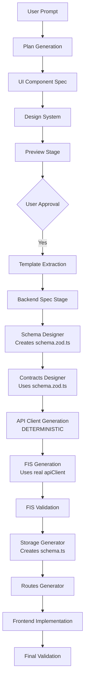

# Complete Pipeline Flow with Schema System

## The Two-Schema Architecture

The Leonardo pipeline uses a **two-schema system** that separates database concerns from API validation:

### 1. `schema.ts` - Drizzle ORM (Database Layer)
- Database table definitions
- Column types, constraints, relationships
- Used by storage layer for database operations
- Generated by: **Schema Generator Agent** (legacy, being phased out)

### 2. `schema.zod.ts` - Zod Validation (API Layer) ✨
- Runtime validation schemas
- Request/response validation
- Type inference for TypeScript
- Generated by: **Schema Designer Agent** (new, preferred)

## Complete Pipeline Order (CORRECTED)



## Detailed Stage-by-Stage Flow

### Stage 1-4: Planning & Preview
```
User Prompt → Plan → UI Spec → Design → Preview
```
Standard flow, unchanged.

### Stage 5: Build Stage (ENHANCED)

#### 5.1: Backend Spec Stage (NEW!)
This is a composite stage that runs TWO Writer-Critic loops:

**A. Schema Designer (schema.zod.ts)**
```typescript
// Generated: app/shared/schema.zod.ts
import { z } from 'zod';

export const ChapelSchema = z.object({
  id: z.string().uuid(),
  name: z.string().min(1),
  capacity: z.number().positive(),
  // ... all fields with validation
});

export const InsertChapelSchema = ChapelSchema.omit({
  id: true,
  createdAt: true
});

export const UpdateChapelSchema = InsertChapelSchema.partial();
```

**B. Contracts Designer (uses schema.zod.ts)**
```typescript
// Generated: app/shared/contracts/chapels.contract.ts
import { ChapelSchema, InsertChapelSchema } from '../schema.zod';

export const chapelsContract = c.router({
  getChapels: {
    method: 'GET',
    path: '/chapels',
    responses: {
      200: z.array(ChapelSchema)  // ← Using Zod schema!
    }
  },
  createChapel: {
    method: 'POST',
    path: '/chapels',
    body: InsertChapelSchema,     // ← Using Zod schema!
    responses: {
      201: ChapelSchema
    }
  }
});
```

#### 5.2: API Client Generation (DETERMINISTIC!)
```bash
# Run fix_api_client.py programmatically
python fix_api_client.py /apps/wedding-chapel/app
```

**Generates:**
```typescript
// app/client/src/lib/api.ts
import { initClient } from '@ts-rest/core';
import { chapelsContract } from '@shared/contracts/chapels.contract';

const contractsRouter = {
  chapels: chapelsContract,
  // ... all contracts
};

export const apiClient = initClient(contractsRouter, {
  baseUrl: import.meta.env.VITE_API_URL || 'http://localhost:5000'
});
```

#### 5.3: FIS Generation (Can Now Use Real Client!)
```markdown
## Homepage Implementation

### Featured Chapels
```typescript
import { apiClient } from '@/lib/api';  // ← REAL CLIENT EXISTS!

const result = await apiClient.chapels.getChapels({
  query: { limit: 6, sortBy: 'rating' }  // ← VALIDATED SYNTAX!
});
```
```

#### 5.4: Storage Generator (Creates Drizzle schema.ts)
**Now generates schema.ts FROM schema.zod.ts!**
```typescript
// Generated: app/shared/schema.ts
import { pgTable, varchar, integer, timestamp } from 'drizzle-orm/pg-core';

export const chapels = pgTable('chapels', {
  id: varchar('id').primaryKey().default(sql`gen_random_uuid()`),
  name: varchar('name', { length: 255 }).notNull(),
  capacity: integer('capacity').notNull(),
  // ... database columns matching Zod schema
});
```

## Why This Order Works

### The Critical Insight
```
Zod Schemas (schema.zod.ts) are the SOURCE OF TRUTH
           ↓
    Contracts use them
           ↓
    API Client uses contracts
           ↓
    FIS references real client
           ↓
    Frontend uses validated FIS
           ↓
    Storage implements database layer
```

### Benefits of This Approach

1. **Single Source of Truth**: Zod schemas define the data model
2. **Type Safety**: Everything flows from strongly-typed schemas
3. **Deterministic Client**: No LLM guessing for critical infrastructure
4. **Validation at Every Step**: Each stage validates against previous
5. **Self-Healing**: Errors caught early with specific fixes

## Key Files and Their Relationships

```
shared/
├── schema.zod.ts          # 1. Pure Zod schemas (validation)
├── contracts/             # 2. ts-rest contracts (import from schema.zod)
│   ├── users.contract.ts
│   └── chapels.contract.ts
└── schema.ts              # 4. Drizzle ORM (generated from schema.zod)

client/src/lib/
└── api.ts                 # 3. ts-rest client (generated from contracts)

plan/
└── frontend-interaction-spec.md  # Uses real apiClient methods
```

## Common Misconceptions Cleared Up

### ❌ Wrong Understanding:
"FIS generates API calls theoretically" → Frontend implements → Breaks at runtime

### ✅ Correct Understanding:
"FIS uses REAL apiClient that EXISTS" → Frontend copies validated patterns → Works!

### ❌ Wrong Order:
Schema.ts → Contracts → FIS → API Client

### ✅ Correct Order:
Schema.zod.ts → Contracts → API Client → FIS → Schema.ts

## Implementation Checklist

- [x] Schema Designer generates `schema.zod.ts`
- [x] Contracts Designer uses `schema.zod.ts`
- [x] API Client generated deterministically
- [x] FIS Writer references real `apiClient`
- [x] FIS Validator checks against contracts
- [x] Storage Generator creates `schema.ts` from `schema.zod.ts`
- [ ] Update build_stage.py to use correct order
- [ ] Ensure FIS Writer can import and analyze `api.ts`

## Summary

The key insight is that **schema.zod.ts is the source of truth**, and the **API client must be generated BEFORE the FIS** so the FIS can reference real, validated methods instead of guessing. This makes the pipeline deterministic and self-validating at every step.