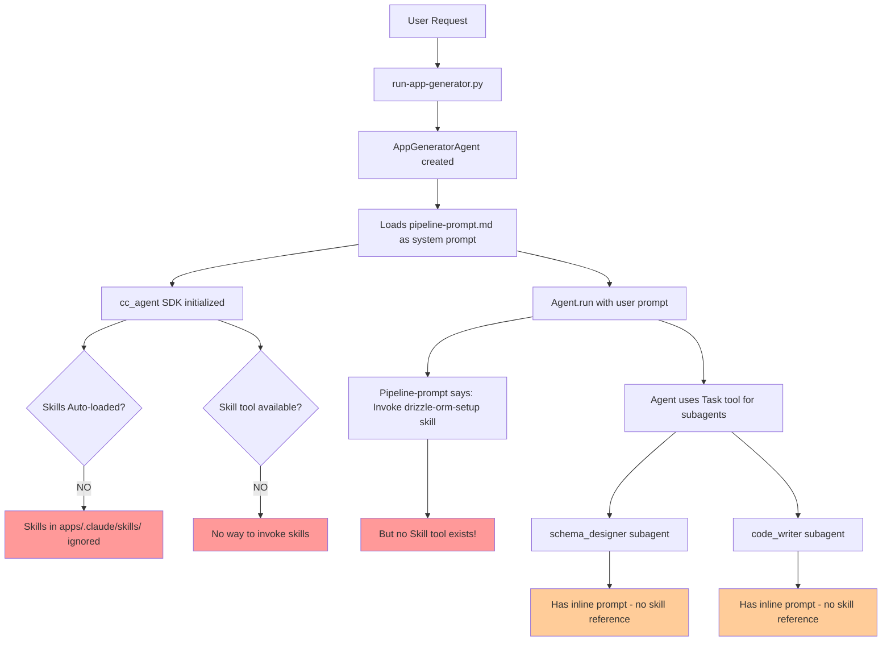

# Forensic Analysis Report: Skills & Subagents Integration

## Executive Summary

**Critical Finding**: Skills exist but are NOT being invoked. They are "aspirational documentation" - the pipeline-prompt.md says "Invoke skill X" but there is NO mechanism for skills to be loaded or invoked. Subagents have their own inline prompts that don't reference skill content, leading to repeated production issues that the skills were designed to prevent.

**Impact**: The 7 skills contain solutions to critical issues (field name mismatch, lazy initialization, snake_case conversion) but this knowledge never reaches the code generation process.

## Section 1: Execution Flow Diagram



### Key Findings:

1. **No Skill Tool**: The agent has access to `Task` tool but NO `Skill` tool
2. **No Auto-loading**: Skills in `apps/.claude/skills/` are NOT automatically loaded by cc_agent SDK
3. **Subagent Isolation**: Subagents have inline prompts in Python files, not referencing skills
4. **Pipeline Wishful Thinking**: Pipeline-prompt.md says "Invoke skill" but provides no mechanism

## Section 2: Skills Audit

| Skill Name | Purpose | Pipeline Says | Actual Invocation | Evidence |
|------------|---------|---------------|-------------------|-----------|
| **drizzle-orm-setup** | Prevent snake_case issues, setup Drizzle client | "🔧 BEFORE GENERATING shared/schema.ts, Invoke: drizzle-orm-setup skill (MANDATORY)" | **NOT INVOKED** | No Skill tool in allowed_tools, subagent prompts don't mention it |
| **factory-lazy-init** | Prevent eager initialization race conditions | "🔧 BEFORE GENERATING server/lib/auth/factory.ts, Invoke: factory-lazy-init skill (MANDATORY)" | **NOT INVOKED** | No Skill tool, but pattern IS in some apps (learned elsewhere?) |
| **schema-query-validator** | Validate schema constraints before pages | Should be invoked before generating pages | **NOT INVOKED** | No reference in code_writer subagent |
| **module-loading-validator** | Ensure correct import order | "🔧 BEFORE GENERATING server/routes/*.ts" | **NOT INVOKED** | No Skill tool available |
| **api-integration-patterns** | Best practices for API integration | Not explicitly referenced | **NOT INVOKED** | No mechanism exists |
| **schema-field-alignment** | Ensure field names match across layers | Not explicitly referenced | **NOT INVOKED** | No mechanism exists |
| **supabase-storage** | Alternative to Drizzle for RLS | Not explicitly referenced | **NOT INVOKED** | No mechanism exists |

## Section 3: Subagent Analysis

### schema_designer Subagent

**Location**: `/src/app_factory_leonardo_replit/agents/app_generator/subagents/schema_designer.py`

**Prompt Analysis**:
- ✅ Has guidance about field naming consistency
- ❌ Does NOT reference drizzle-orm-setup skill
- ❌ Does NOT mention snake_case configuration for Drizzle
- ❌ Does NOT teach about `db.ts` client creation

**Critical Missing Knowledge**:
```typescript
// From drizzle-orm-setup skill - NOT in subagent prompt:
export const db = drizzle(client, {
  schema,
  casing: 'snake_case'  // CRITICAL: Prevents field mismatch
});
```

### code_writer Subagent

**Location**: `/src/app_factory_leonardo_replit/agents/app_generator/subagents/code_writer.py`

**Prompt Analysis**:
- ✅ Has general coding best practices
- ❌ Does NOT reference factory-lazy-init skill
- ❌ Does NOT teach lazy Proxy pattern
- ❌ Missing critical pattern that prevents race conditions

**Critical Missing Knowledge**:
```typescript
// From factory-lazy-init skill - NOT in subagent prompt:
export const auth = new Proxy({} as IAuth, {
  get(target, prop) {
    if (!instance) {
      instance = createAuth(); // Delays until after dotenv
    }
    return instance[prop as keyof IAuth];
  }
});
```

## Section 4: Evidence from Generated Apps

### Fizzcard App
- ✅ HAS lazy proxy pattern in storage/factory.ts
- ❌ NO `server/lib/db.ts` file (Drizzle client)
- **Conclusion**: Partial skill application, likely from pipeline-prompt examples

### KidIQ App
- ✅ HAS lazy proxy pattern in storage/factory.ts
- ❌ NO `server/lib/db.ts` file (Drizzle client)
- **Conclusion**: Same as Fizzcard - partial knowledge transfer

### Pattern Observed
Apps are getting SOME patterns (lazy proxy) but NOT others (Drizzle client setup). This suggests:
1. Pipeline-prompt.md includes example code with lazy proxy
2. But skills with additional critical details are never invoked
3. Result: Partial implementation leading to production issues

## Section 5: Root Cause Analysis

### Why Skills Aren't Being Used

1. **No Invocation Mechanism**
   - No `Skill` tool in `allowed_tools` list
   - cc_agent SDK doesn't auto-load from `apps/.claude/skills/`
   - Pipeline says "Invoke skill" but can't

2. **Subagent Architecture**
   - Subagents defined in Python with inline prompts
   - These prompts are self-contained, don't reference skills
   - When main agent delegates via Task tool, subagent only sees its inline prompt

3. **Knowledge Fragmentation**
   - Critical knowledge split between:
     - Pipeline-prompt.md (has some patterns)
     - Skills (have detailed solutions)
     - Subagent prompts (have different guidance)
   - No unified knowledge base

## Section 6: Impact Assessment

### Issues That Would Be Prevented If Skills Were Used

| Issue | Time Wasted | Apps Affected | Skill That Prevents It |
|-------|-------------|---------------|------------------------|
| Field name mismatch (snake_case) | 35 min | KidIQ, Fizzcard | drizzle-orm-setup |
| Lazy init race condition | 20 min | Fizzcard | factory-lazy-init (partially applied) |
| Missing Drizzle client | Unknown | All apps | drizzle-orm-setup |
| Schema validation issues | 15 min | Multiple | schema-query-validator |
| Module loading order | 10 min | Multiple | module-loading-validator |

**Total Documented Time Lost**: 80+ minutes across multiple apps

## Section 7: Recommendations

### Immediate Fix (Option A): Embed Skills in Subagent Prompts

Since subagents can't access skills, embed the critical knowledge directly:

```python
# schema_designer.py - ADD THIS:
prompt = """... existing prompt ...

## CRITICAL: Drizzle Client Setup
ALWAYS create server/lib/db.ts with:
- drizzle() client with { schema, casing: 'snake_case' }
- This prevents field name mismatch issues
[Include full skill content here]
"""
```

### Immediate Fix (Option B): Add Skills to Pipeline-Prompt

Since pipeline-prompt.md is loaded as system prompt, include skill content inline:

```markdown
## Stage 2.1.2: Drizzle Schema

[Instead of "Invoke skill", paste skill content here]

### Required Setup for Drizzle
1. Create server/lib/db.ts:
```typescript
// Full code from skill
```
```

### Long-term Fix (Option C): Implement Skill Tool

Add a Skill tool to cc_agent that can:
1. Load skill content from `apps/.claude/skills/`
2. Return skill content when invoked
3. Allow `Invoke: skill-name` to actually work

### Long-term Fix (Option D): Unified Knowledge Base

Create a single source of truth:
1. Merge skills into subagent prompts programmatically
2. Or load skills dynamically when creating subagents
3. Ensure all agents have access to all prevention patterns

## Section 8: Validation Script

Create `scripts/validate-skill-application.py`:

```python
def check_app_for_skill_patterns(app_path):
    """Check if an app has patterns from skills"""

    checks = {
        "lazy_proxy": check_for_lazy_proxy(app_path),
        "drizzle_client": check_for_drizzle_db(app_path),
        "snake_case_config": check_for_casing_config(app_path),
        "proper_imports": check_import_order(app_path),
    }

    return checks

def check_for_drizzle_db(app_path):
    """Check if server/lib/db.ts exists with proper setup"""
    db_file = Path(app_path) / "server/lib/db.ts"
    if not db_file.exists():
        return False, "Missing server/lib/db.ts"

    content = db_file.read_text()
    if "casing: 'snake_case'" not in content:
        return False, "Missing snake_case configuration"

    return True, "Drizzle properly configured"
```

## Section 9: Executive Recommendations

### Priority 1: Fix Knowledge Gap (This Week)
Choose Option A or B to immediately embed skill knowledge where it's needed.

### Priority 2: Validate Existing Apps (This Week)
Run validation script on all generated apps to identify which need fixes.

### Priority 3: Implement Proper Skill System (Next Sprint)
Either implement Skill tool or merge skills into subagent prompts programmatically.

### Success Metrics
- Zero field name mismatch errors in new apps
- Zero lazy initialization race conditions
- All apps have `server/lib/db.ts` with proper configuration
- Time to debug production issues reduced by 80%

## Conclusion

The skills system is well-designed with excellent solutions to real problems, but it's completely disconnected from the actual code generation process. The phrase "Invoke skill" in pipeline-prompt.md is wishful thinking - there's no mechanism to actually invoke skills.

**The fix is straightforward**: Embed the skill knowledge where it's actually used (subagent prompts) rather than in an inaccessible location (`apps/.claude/skills/`).

This explains why the same issues keep occurring despite having documented solutions - the solutions exist but never reach the code generation process.