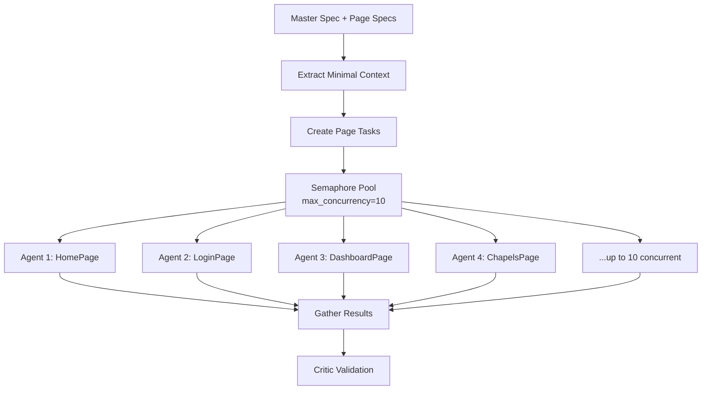
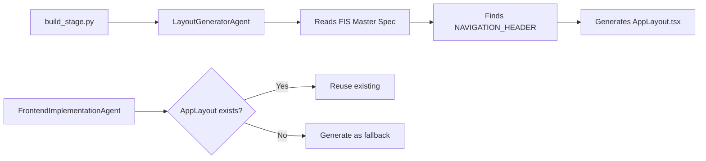

# Parallel Frontend Implementation Plan

## Executive Summary

This document outlines a comprehensive plan to implement TRUE parallel frontend page generation using Python asyncio with configurable concurrency control. It also clarifies the AppLayout.tsx generation flow and proposes optimizations.

---

## 🔴 Current Problems

### 1. Fake Parallelization
The current "modular" implementation **does NOT actually parallelize**:
```python
# Current approach - WRONG
user_prompt = f"""
{master_spec_content}  # 40KB
{all_page_specs}        # 140KB combined
{schema_content}        # 7KB
{contracts_content}     # 20KB
"""
result = await agent.run(user_prompt)  # Single agent, 200KB+ context
```

**Issues:**
- Single agent instance receives ALL specs (200KB+)
- Token limits cause incomplete generation
- Agent says "Due to token limits..." and generates sequentially
- No actual parallel execution

### 2. AppLayout.tsx Design Divergence
Currently TWO agents can generate AppLayout:
1. **LayoutGeneratorAgent** (in build_stage.py) - Uses glassmorphism, purple gradients
2. **FrontendImplementationAgent** - Uses clean modern design

**Issues:**
- Design inconsistency (glassmorphism in layout vs clean pages)
- Unnecessary complexity (separate stage just for layout)
- Two different design interpretations

---

## ✅ Proposed Solution: True Parallel Architecture

### Core Architecture

```python
import asyncio
from typing import Dict, List, Optional
from dataclasses import dataclass
from pathlib import Path

@dataclass
class PageGenerationTask:
    """Single page generation task."""
    page_name: str
    page_spec: str
    page_route: str
    dependencies: List[str] = None  # e.g., ["AppLayout", "AuthContext"]

class ParallelFrontendGenerator:
    """Orchestrates true parallel page generation."""

    def __init__(
        self,
        app_dir: Path,
        max_concurrency: int = 10,  # Configurable!
        timeout_per_page: int = 120  # seconds
    ):
        self.app_dir = app_dir
        self.max_concurrency = max_concurrency
        self.timeout = timeout_per_page
        self.semaphore = asyncio.Semaphore(max_concurrency)

    async def generate_all_pages(
        self,
        master_spec: Dict,
        page_specs: Dict[str, str]
    ) -> Dict[str, Any]:
        """Generate all pages in parallel with concurrency control."""

        # Phase 1: Extract minimal shared context
        shared_context = self._extract_minimal_context(master_spec)

        # Phase 2: Create page tasks
        tasks = []
        for page_name, page_spec in page_specs.items():
            task = self._create_page_task(
                page_name,
                page_spec,
                shared_context
            )
            tasks.append(task)

        # Phase 3: Execute with concurrency control
        results = await asyncio.gather(*tasks, return_exceptions=True)

        # Phase 4: Collect and report results
        return self._process_results(results)

    async def _generate_single_page(
        self,
        task: PageGenerationTask,
        shared_context: Dict
    ) -> Dict:
        """Generate a single page with its own agent instance."""

        async with self.semaphore:  # Concurrency control!
            try:
                # Each page gets its OWN agent
                agent = PageGeneratorAgent(cwd=str(self.app_dir))

                # Minimal context per page
                result = await asyncio.wait_for(
                    agent.generate_page(
                        page_name=task.page_name,
                        page_spec=task.page_spec,
                        api_registry=shared_context['api_registry'],
                        design_tokens=shared_context['design_tokens'],
                        app_layout_path=shared_context['app_layout_path']
                    ),
                    timeout=self.timeout
                )

                return {
                    'page': task.page_name,
                    'success': result.success,
                    'path': f"pages/{task.page_name}.tsx"
                }

            except asyncio.TimeoutError:
                return {
                    'page': task.page_name,
                    'success': False,
                    'error': f"Timeout after {self.timeout}s"
                }
```

### Execution Flow



### Key Improvements

1. **True Parallelization**
   - Each page gets its OWN agent instance
   - Asyncio.gather() for concurrent execution
   - No shared state between agents

2. **Configurable Concurrency**
   ```python
   generator = ParallelFrontendGenerator(
       app_dir=app_path,
       max_concurrency=10  # Adjustable based on system resources
   )
   ```

3. **Minimal Context Per Page**
   ```python
   # Each page only receives:
   {
       "page_spec": "...",           # ~15-20KB
       "api_registry": "...",         # ~5KB
       "design_tokens": "...",        # ~2KB
       "app_layout_path": "/path"     # Reference only
   }
   # Total: ~25KB per agent (vs 200KB+ currently)
   ```

4. **Timeout Protection**
   - Each page has timeout (default 120s)
   - Failed pages don't block others
   - Clear error reporting

---

## 🏗️ AppLayout.tsx Generation Strategy

### Current Flow Analysis



### Problems with Current Approach

1. **Design Divergence**
   - LayoutGeneratorAgent: Uses glassmorphism, purple gradients (aesthetic-focused)
   - FrontendImplementationAgent: Uses clean modern design (functional-focused)
   - **Result**: Inconsistent user experience

2. **Two Sources of Truth**
   - LayoutGeneratorAgent: Reads NAVIGATION_HEADER pattern
   - FrontendImplementationAgent: Has its own layout logic
   - Risk of conflicting implementations

3. **Sequential Dependency**
   - Pages wait for AppLayout
   - Blocks parallel generation if missing

### Adopted Solution: Option A - Single Source AppLayout (FrontendImplementationAgent)

```python
class AppLayoutManager:
    """Single source of truth for AppLayout generation."""

    def __init__(self, app_dir: Path):
        self.app_dir = app_dir
        self.layout_path = app_dir / "client/src/components/layout/AppLayout.tsx"

    async def ensure_app_layout(self, master_spec_content: str) -> bool:
        """Ensure AppLayout exists before page generation."""

        if self.layout_path.exists():
            logger.info("✅ AppLayout already exists, reusing")
            return True

        # FrontendImplementationAgent is the ONLY generator
        logger.info("🎨 Generating AppLayout from master spec")
        agent = FrontendImplementationAgent(cwd=str(self.app_dir))

        # Extract navigation pattern from master spec
        navigation_pattern = self._extract_navigation_pattern(master_spec_content)

        result = await agent.generate_app_layout(
            navigation_spec=navigation_pattern,
            master_spec=master_spec_content
        )

        if result.success:
            logger.info("✅ AppLayout generated successfully")
            return True
        else:
            # Critical failure - pages can't be generated without layout
            raise Exception(f"Failed to generate AppLayout: {result.message}")
```

### Implementation: FrontendImplementationAgent as Single Source

**Benefits of Option A:**
1. **Single Design Language** - Consistent clean modern design across layout and pages
2. **No Design Divergence** - Eliminates glassmorphism vs clean design conflict
3. **Simplified Architecture** - One agent owns all frontend generation
4. **Consistent Context** - Same agent understands both layout and page requirements

**Implementation Steps:**
1. **Extend FrontendImplementationAgent** with dedicated `generate_app_layout()` method
2. **Remove LayoutGeneratorAgent** from the pipeline entirely
3. **Update build_stage.py** to use FrontendImplementationAgent for AppLayout
4. **Ensure parallel page generation** reuses the existing AppLayout

---

## 📋 Implementation Plan

### Phase 1: Create New Page Generator Agent (Week 1)

```python
# New file: agents/page_generator/agent.py
class PageGeneratorAgent:
    """Lightweight agent for single page generation."""

    async def generate_page(
        self,
        page_name: str,
        page_spec: str,
        api_registry: str,
        design_tokens: str,
        app_layout_path: str
    ) -> AgentResult:
        """Generate ONE page with minimal context."""

        user_prompt = f"""
        Generate ONLY the {page_name} component.

        Page Specification:
        {page_spec}

        Available APIs:
        {api_registry}

        Design Tokens:
        {design_tokens}

        CRITICAL: Import and wrap with AppLayout from {app_layout_path}
        """

        return await self.agent.run(user_prompt)
```

### Phase 2: Implement Parallel Orchestrator (Week 1)

```python
# New file: orchestrators/parallel_frontend_orchestrator.py
class ParallelFrontendOrchestrator:
    """Manages parallel page generation."""

    async def orchestrate(self, app_dir: Path) -> Dict:
        # Step 1: Load specs first
        master_spec = self._load_master_spec()
        page_specs = self._load_page_specs()

        # Step 2: Ensure AppLayout exists using FrontendImplementationAgent
        layout_mgr = AppLayoutManager(app_dir)
        await layout_mgr.ensure_app_layout(master_spec_content=master_spec)

        # Step 3: Parallel generation
        generator = ParallelFrontendGenerator(
            app_dir=app_dir,
            max_concurrency=10
        )
        results = await generator.generate_all_pages(
            master_spec,
            page_specs
        )

        # Step 4: Run critic
        critic = BrowserVisualCriticAgent(cwd=str(app_dir))
        validation = await critic.test_frontend()

        return {
            'pages_generated': results,
            'validation': validation
        }
```

### Phase 3: Create CLI Interface (Week 2)

```python
# New file: run_parallel_frontend.py
import argparse
import asyncio

async def main():
    parser = argparse.ArgumentParser()
    parser.add_argument('app_dir', type=Path)
    parser.add_argument('--max-concurrency', type=int, default=10)
    parser.add_argument('--timeout', type=int, default=120)
    args = parser.parse_args()

    orchestrator = ParallelFrontendOrchestrator()
    results = await orchestrator.orchestrate(
        app_dir=args.app_dir,
        max_concurrency=args.max_concurrency,
        timeout=args.timeout
    )

    # Report results
    print(f"✅ Generated {len(results['pages_generated'])} pages")
    print(f"📊 Validation: {results['validation']['score']}/100")

if __name__ == "__main__":
    asyncio.run(main())
```

### Phase 4: Testing & Optimization (Week 2)

1. **Benchmark Different Concurrency Levels**
   ```python
   for concurrency in [5, 10, 15, 20]:
       start = time.time()
       await run_with_concurrency(concurrency)
       print(f"Concurrency {concurrency}: {time.time() - start}s")
   ```

2. **Monitor Resource Usage**
   - Memory per agent
   - API rate limits
   - Token consumption

3. **Error Recovery**
   - Retry failed pages
   - Partial success handling
   - Clear error reporting

---

## 🎯 Success Metrics

### Performance Targets
- **Generation Time**: < 5 minutes for 10 pages (vs 30+ minutes sequential)
- **Concurrency**: Support 10+ parallel agents
- **Memory Usage**: < 2GB total
- **Success Rate**: > 95% pages generate correctly first try

### Quality Metrics
- **Zero Console Errors**: All pages load without JavaScript errors
- **Design Consistency**: All pages follow master spec patterns
- **API Integration**: All pages use correct API methods
- **Critic Score**: > 90/100 on first generation

---

## 🚦 Migration Strategy

### Step 1: Parallel Development
- Keep existing FrontendImplementationAgent
- Develop new parallel system alongside
- Test on multiple apps

### Step 2: Remove LayoutGeneratorAgent
- Delete `agents/layout_generator/` directory
- Remove from build_stage.py imports
- Update all references to use FrontendImplementationAgent

### Step 3: A/B Testing
- Run new system with FrontendImplementationAgent as single source
- Compare:
  - Generation time (parallel vs sequential)
  - Design consistency (no more divergence)
  - Resource usage

### Step 4: Gradual Rollout
- Start with new apps
- Migrate existing apps one by one
- Monitor for issues

### Step 5: Deprecation
- After 30 days of stable operation
- Remove old implementation
- Update all documentation

---

## 📊 Resource Estimation

### Development Resources
- **Engineering Time**: 2 weeks
  - Week 1: Core implementation
  - Week 2: Testing & optimization
- **Testing**: 5 different applications
- **Documentation**: 2 days

### Runtime Resources (Per App)
```
Pages:          10
Concurrency:    10
Time per page:  ~60s
Total time:     ~60s (parallel) vs 600s (sequential)
Memory:         ~200MB per agent × 10 = 2GB peak
API calls:      ~50 per page × 10 = 500 total
```

---

## 🔄 Continuous Improvements

### Phase 1: Basic Parallelization (This Plan)
- Asyncio with semaphore
- Fixed concurrency
- Basic error handling

### Phase 2: Smart Scheduling (Future)
- Dependency-aware scheduling
- Dynamic concurrency based on load
- Priority queue for critical pages

### Phase 3: Advanced Optimization (Future)
- Caching shared components
- Incremental generation
- Hot reload support

---

## 📝 Summary

### Key Decisions
1. **Use Python asyncio** with semaphore for concurrency control
2. **Separate agent per page** with minimal context
3. **FrontendImplementationAgent as single source** for AppLayout (Option A)
4. **Configurable concurrency** (default: 10)
5. **Timeout protection** per page

### Expected Outcomes
- **10x faster** page generation (60s vs 600s)
- **Better resource usage** (25KB vs 200KB per agent)
- **Higher success rate** (no token limit issues)
- **True parallelization** (actual concurrent execution)
- **Design consistency** (single source eliminates divergence)

### Next Steps
1. Review and approve this plan
2. Create development branch
3. Extend FrontendImplementationAgent with `generate_app_layout()` method
4. Implement Phase 1 (PageGeneratorAgent for parallel pages)
5. Remove LayoutGeneratorAgent from pipeline
6. Test with timeless-weddings app
7. Iterate based on results

---

## Appendix A: Example Usage

```bash
# Generate with default settings
./run_parallel_frontend.sh apps/timeless-weddings-phase1/app

# Custom concurrency
./run_parallel_frontend.sh apps/my-app --max-concurrency 5

# With timeout adjustment
./run_parallel_frontend.sh apps/complex-app --timeout 180

# Verbose mode
./run_parallel_frontend.sh apps/my-app --verbose
```

## Appendix B: Monitoring Dashboard

```python
class GenerationMonitor:
    """Real-time monitoring of parallel generation."""

    def display_progress(self):
        """
        ┌─────────────────────────────────────┐
        │ Parallel Frontend Generation        │
        ├─────────────────────────────────────┤
        │ ✅ HomePage        (12s)            │
        │ ✅ LoginPage       (15s)            │
        │ ⏳ DashboardPage   (8s...)          │
        │ ⏳ ChapelsPage     (6s...)          │
        │ ⏳ ProfilePage     (4s...)          │
        │ ⌛ BookingPage     (waiting...)     │
        │ ⌛ CheckoutPage    (waiting...)     │
        ├─────────────────────────────────────┤
        │ Progress: 2/7 complete              │
        │ Concurrency: 3/10 slots used        │
        │ Est. Time: 45s remaining            │
        └─────────────────────────────────────┘
        """
```