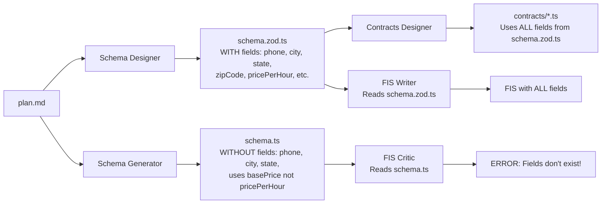

# Leonardo Pipeline Type Safety Analysis & Fix Plan
**Date: 2025-10-02**

## Executive Summary

The Leonardo Pipeline has a critical type safety break causing the Frontend Interaction Spec to reference database fields that "don't exist" according to the critic. After deep investigation, we found that the pipeline generates TWO different schemas that are out of sync, breaking end-to-end type safety.

## The Root Cause: Two Schemas, Different Fields

### Current Problematic Flow



## Deep Dive: The Type Safety Chain

### 1. Schema Generation Pipeline

#### Phase 1: Backend Spec Stage
- **Schema Designer Agent** → Creates `schema.zod.ts`
  - Input: plan.md
  - Output: Pure Zod schemas with comprehensive fields
  - Example fields: `phone`, `city`, `state`, `zipCode`, `pricePerHour`, `durationHours`, `maxGuests`

- **Contracts Designer Agent** → Creates `contracts/*.contract.ts`
  - Input: schema.zod.ts
  - Output: ts-rest contracts importing from schema.zod.ts
  - Uses ALL fields from schema.zod.ts

#### Phase 2: Build Stage - Schema Generator
- **Schema Generator Agent** → Creates `schema.ts`
  - Input: plan.md and App.tsx (NOT schema.zod.ts!)
  - Output: Drizzle ORM schema
  - **PROBLEM**: Generates from scratch, different fields than schema.zod.ts

### 2. Current Schema Differences

#### schema.zod.ts (Source of Truth)
```typescript
// User has phone field
export const UserSchema = z.object({
  phone: z.string().optional(),
  // ...
});

// Chapel has detailed address
export const ChapelSchema = z.object({
  city: z.string().min(1, 'City is required'),
  state: z.string().min(2, 'State is required'),
  zipCode: z.string().regex(/^\d{5}(-\d{4})?$/, 'Invalid ZIP code'),
  pricePerHour: z.number().positive('Price must be positive'),
  // ...
});

// Package has guest/duration details
export const PackageSchema = z.object({
  durationHours: z.number().int().positive('Duration must be positive'),
  maxGuests: z.number().int().positive('Max guests must be positive'),
  includedServices: z.array(z.string()).default([]),
  // ...
});
```

#### schema.ts (Out of Sync)
```typescript
// User has NO phone field
export const users = pgTable("users", {
  // No phone field!
  // ...
});

// Chapel has single location field, different price field
export const chapels = pgTable("chapels", {
  location: varchar("location", { length: 255 }).notNull(),
  // No city, state, zipCode!
  basePrice: decimal("base_price", { precision: 10, scale: 2 }).notNull(),
  // Not pricePerHour!
  // ...
});

// Package missing guest/duration details
export const packages = pgTable("packages", {
  // No durationHours, maxGuests, includedServices!
  // ...
});
```

### 3. Import Chain Analysis

#### ✅ Good: Most Files Import from schema.zod.ts
- `storage.ts`: `import { ... } from "@shared/schema.zod"`
- `routes.ts`: `import { ... } from "@shared/schema.zod"`
- `contracts/*.contract.ts`: `import { ... } from '../schema.zod'`
- `api.ts`: Imports contracts (which import schema.zod)

#### ❌ Problem: Critics Read Wrong Schema
- **FIS Writer**: Reads `schema.zod.ts` (passed as `schema_path` at line 1084 in build_stage.py)
- **FIS Critic**: Reads `schema.ts` (hardcoded at line 241 in build_stage.py)
- Result: Writer uses full fields, Critic says they don't exist

## The Question: Do We Need Both Schemas?

### Answer: YES, We Need Both (But They Must Match!)

#### Why schema.zod.ts?
1. **Pure validation schemas** - Used by frontend and API contracts
2. **Platform agnostic** - Can be used with any database
3. **Source of truth** for field definitions and validation rules
4. **Used by**: Contracts, API validation, frontend forms

#### Why schema.ts?
1. **Database-specific ORM definitions** - Drizzle ORM for PostgreSQL
2. **Contains database metadata** - Default values, SQL functions
3. **Migration support** - Drizzle can generate SQL migrations
4. **Used by**: Storage layer, database queries

## The Solution: Agentically Enforced Schema Synchronization

### Core Principle: schema.zod.ts as Source of Truth
The Schema Generator must READ schema.zod.ts and CREATE schema.ts with matching fields.

### Implementation Plan

#### 1. Fix Schema Generator Agent

**Current Behavior (WRONG)**:
- Input: plan.md, App.tsx
- Output: schema.ts generated from scratch

**New Behavior (CORRECT)**:
- Input: **schema.zod.ts**, plan.md
- Output: schema.ts converted from schema.zod.ts
- Process: Read Zod schemas, convert to Drizzle schemas with same fields
- **Note**: App.tsx is NOT needed for schema conversion

**System Prompt Update**:
```markdown
## Your Role
Convert Zod validation schemas (schema.zod.ts) into Drizzle ORM schemas (schema.ts) while maintaining EXACT field parity.

## Critical Requirements
1. READ the existing schema.zod.ts file FIRST
2. Every field in schema.zod.ts MUST exist in schema.ts
3. Field names MUST match exactly (e.g., if Zod has 'pricePerHour', Drizzle must too)
4. Field types must be compatible (Zod string → Drizzle varchar/text)
5. DO NOT add or remove fields based on plan.md - schema.zod.ts is the source of truth
6. DO NOT use App.tsx - schema conversion is data layer only
```

#### 2. Fix Schema Generator Critic

**Add Validation**:
```markdown
## Validation Requirements
1. Compare schema.ts against schema.zod.ts
2. Ensure EVERY field in schema.zod.ts exists in schema.ts
3. Flag any missing fields as CRITICAL errors
4. Flag any extra fields in schema.ts as warnings
5. Verify type compatibility between corresponding fields
```

#### 3. Fix FIS Critic to Read Correct Schema

**Current (build_stage.py line 241)**:
```python
schema_path = app_dir / "shared" / "schema.ts"  # WRONG!
```

**Fixed**:
```python
schema_path = app_dir / "shared" / "schema.zod.ts"  # Read same schema as writer
```

#### 4. Add Schema Sync Validation Step

Create a new validation that runs after Schema Generator:
```python
def validate_schema_sync(schema_zod_path: Path, schema_ts_path: Path) -> bool:
    """Ensure schema.zod.ts and schema.ts have matching fields."""
    # Parse both files
    # Extract field names from each entity
    # Compare and report differences
    # Return False if critical mismatches
```

## Self-Healing Benefits of Agentic Approach

### 1. Automatic Field Mapping
The Schema Generator agent can intelligently map Zod types to Drizzle types:
- `z.string()` → `varchar()` or `text()`
- `z.number()` → `integer()` or `decimal()`
- `z.boolean()` → `boolean()`
- `z.date()` → `timestamp()`

### 2. Validation Rules Preservation
Convert Zod validation to Drizzle/database constraints:
- `z.string().min(1)` → `.notNull()`
- `z.string().email()` → Add comment for application-level validation
- `z.string().uuid()` → Use appropriate UUID type

### 3. Self-Healing on Schema Changes
When schema.zod.ts is updated:
1. Schema Generator reads new version
2. Updates schema.ts to match
3. Critic validates synchronization
4. Pipeline fails if sync breaks

### 4. Clear Error Messages
Critic provides specific feedback:
- "Missing field 'phone' in users table (exists in UserSchema)"
- "Type mismatch: 'pricePerHour' is number in Zod but missing in Drizzle"
- "Extra field 'basePrice' in Drizzle not found in Zod schema"

## Migration Path

### Phase 1: Quick Fix (Immediate)
1. Update FIS Critic to read schema.zod.ts instead of schema.ts
2. Document that schema.ts is currently out of sync

### Phase 2: Schema Generator Update (High Priority)
1. Update Schema Generator to read schema.zod.ts as primary input
2. Remove App.tsx requirement
3. Implement conversion logic
4. Update Schema Generator Critic to validate sync

### Phase 3: Full Validation (Medium Priority)
1. Add schema sync validation step
2. Create comprehensive test cases
3. Update all import statements if needed

### Phase 4: Documentation (Low Priority)
1. Document the schema flow
2. Create developer guide
3. Add examples of proper schema conversion

## Expected Outcomes

### Before Fix
- FIS Writer creates spec with fields from schema.zod.ts
- FIS Critic says fields don't exist (checking schema.ts)
- Type safety broken between frontend and backend
- Runtime errors when frontend tries to use non-existent fields

### After Fix
- Both schemas have identical fields
- FIS Writer and Critic use same schema
- End-to-end type safety maintained
- Frontend can confidently use all fields

## Key Insight: Separation of Concerns

### schema.zod.ts (Business Logic Layer)
- Defines what fields exist
- Defines validation rules
- Platform agnostic
- Source of truth for contracts

### schema.ts (Database Layer)
- Implements how fields are stored
- Database-specific optimizations
- Migration support
- Must mirror business logic fields

## Code Changes Required

### 1. Schema Generator Agent (`schema_generator/agent.py`)
```python
# Current (WRONG)
def __init__(self, schema_path: str, plan_path: str, app_tsx_path: str):
    # Uses App.tsx which is not needed

# Fixed (CORRECT)
def __init__(self, schema_zod_path: str, schema_path: str, plan_path: str):
    # schema_zod_path: Input to read from
    # schema_path: Output to write to
    # plan_path: For context only
```

### 2. Build Stage (`build_stage.py`)
```python
# Current (WRONG)
"writer": SchemaGeneratorAgent(
    schema_path=schema_ts_path,
    plan_path=plan_path_abs,
    app_tsx_path=app_tsx_path  # NOT NEEDED!
),

# Fixed (CORRECT)
"writer": SchemaGeneratorAgent(
    schema_zod_path=schema_zod_path,  # Input
    schema_path=schema_ts_path,        # Output
    plan_path=plan_path_abs            # Context
),
```

### 3. FIS Critic (`build_stage.py` line 241)
```python
# Current (WRONG)
schema_path = app_dir / "shared" / "schema.ts"

# Fixed (CORRECT)
schema_path = app_dir / "shared" / "schema.zod.ts"
```

## Validation Checklist

When implementing the fix, ensure:

- [ ] Schema Generator reads schema.zod.ts as input
- [ ] Schema Generator NO LONGER requires App.tsx
- [ ] Schema Generator converts (not generates) to schema.ts
- [ ] All fields from schema.zod.ts exist in schema.ts
- [ ] Field names match exactly (no renaming like pricePerHour → basePrice)
- [ ] Schema Generator Critic validates field parity
- [ ] FIS Critic reads schema.zod.ts (not schema.ts)
- [ ] Storage.ts continues importing from schema.zod
- [ ] Routes.ts continues importing from schema.zod
- [ ] Type safety maintained end-to-end

## Conclusion

The Leonardo Pipeline's type safety break stems from having two schemas that diverged during generation. By making schema.zod.ts the source of truth and having Schema Generator convert (rather than generate from scratch), we can maintain type safety while keeping the benefits of both validation schemas (Zod) and ORM schemas (Drizzle).

The agentic approach with Writer-Critic validation ensures self-healing: if schemas drift, the Critic will catch it and force convergence, maintaining type safety across the entire stack.

**Critical Change**: App.tsx is NOT needed for schema conversion - this was an incorrect dependency. Schema conversion should be purely data-layer focused, converting from schema.zod.ts to schema.ts.