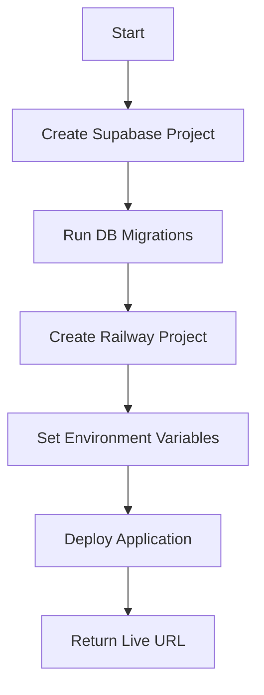

# 🚀 Deployment Automation Pipeline

Fully automated deployment pipeline for AI-generated applications to Supabase and Railway.

## 📋 Overview

This pipeline automates the entire deployment process:
1. Creates Supabase project with database
2. Runs database migrations
3. Creates Railway project
4. Configures environment variables
5. Deploys application
6. Returns live URL

## 🔧 Prerequisites

### 1. Install Dependencies

```bash
cd scripts/deploy-automation
npm install
```

### 2. Install CLIs (Optional but recommended)

```bash
# Supabase CLI
npm install -g supabase

# Railway CLI
npm install -g @railway/cli
railway login
```

### 3. Get Authentication Tokens

#### Supabase Personal Access Token:
1. Go to [https://supabase.com/dashboard/account/tokens](https://supabase.com/dashboard/account/tokens)
2. Click "Generate New Token"
3. Name it (e.g., "app-factory-deployment")
4. Copy the token

#### Supabase Organization ID:
1. Go to [https://supabase.com/dashboard/org/_/general](https://supabase.com/dashboard/org/_/general)
2. Copy your Organization ID

#### Railway API Token:
1. Go to [https://railway.app/account/tokens](https://railway.app/account/tokens)
2. Click "Create Token"
3. Name it (e.g., "app-factory-deployment")
4. Copy the token

### 4. Configure Environment

Add to the root `.env` file:

```env
# Deployment Automation
SUPABASE_ACCESS_TOKEN=your-supabase-token-here
SUPABASE_ORG_ID=your-org-id-here
RAILWAY_API_TOKEN=your-railway-token-here
```

## 🎯 Usage

### Quick Deploy (Recommended)

Deploy an app with a single command:

```bash
npm run deploy -- quick \
  --name "my-app" \
  --path "../../apps/notetaker/app"
```

### Full Deploy with Options

```bash
npm run deploy -- deploy \
  --name "my-app" \
  --path "../../apps/notetaker/app" \
  --region "us-east-1"
```

### Deploy to Existing Projects

```bash
npm run deploy -- deploy \
  --name "my-app" \
  --path "../../apps/notetaker/app" \
  --supabase-project "existing-project-id" \
  --railway-project "existing-project-id"
```

### Skip Supabase or Railway

```bash
# Only create Supabase (no Railway deployment)
npm run deploy -- deploy \
  --name "my-app" \
  --path "../../apps/notetaker/app" \
  --skip-railway

# Only deploy to Railway (no Supabase)
npm run deploy -- deploy \
  --name "my-app" \
  --path "../../apps/notetaker/app" \
  --skip-supabase
```

## 📦 Individual Scripts

### Create Supabase Project Only

```bash
npm run create-supabase "my-project-name"
```

### Create Railway Project Only

```bash
npm run create-railway "my-project-name"
```

### Test Connections

```bash
npm run test-connection
```

## 🏗️ Project Structure

```
deploy-automation/
├── config.ts                 # Configuration and utilities
├── create-supabase-project.ts # Supabase project creation
├── create-railway-project.ts  # Railway project creation  
├── run-migrations.ts         # Database migration runner
├── deploy-full-stack.ts     # Main orchestration script
└── package.json             # Dependencies
```

## 🔄 Deployment Flow



## 📝 Environment Variables Set

The pipeline automatically configures these variables:

### In App's .env:
- `SUPABASE_URL`
- `SUPABASE_ANON_KEY`
- `SUPABASE_SERVICE_ROLE_KEY`

### In Railway:
- `SUPABASE_URL`
- `SUPABASE_ANON_KEY`
- `NODE_ENV=production`

## 🎉 Output

Successful deployment returns:

```
✨ Deployment Complete!
━━━━━━━━━━━━━━━━━━━━━━━━━━━━━━━━━━

📋 Deployment Summary:
   App Name: my-app

   Supabase:
     Project ID: abcdef-1234-5678
     URL: https://abcdef.supabase.co
     Dashboard: https://supabase.com/dashboard/project/abcdef

   Railway:
     Project ID: xyz-789
     🌐 Live URL: https://my-app.up.railway.app
     Dashboard: https://railway.app/project/xyz-789

🎉 Your app is now live!
```

## 🔍 Troubleshooting

### "Missing SUPABASE_ACCESS_TOKEN"
- Ensure token is set in root `.env` file
- Check token hasn't expired
- Verify token has necessary permissions

### "Project creation timed out"
- Check Supabase dashboard for project status
- Retry with existing project ID
- Verify organization has capacity for new projects

### "Railway deployment failed"
- Ensure Railway CLI is installed and logged in
- Check Railway token permissions
- Verify app has proper build scripts

### Database Migration Issues
- Migrations are output to `migration-output.sql`
- Can be manually run in Supabase SQL Editor
- Check Supabase Dashboard > SQL Editor for errors

## 🚨 Important Notes

1. **Costs**: Both Supabase and Railway have free tiers but may incur costs
2. **Secrets**: Never commit `.env` files with real tokens
3. **Regions**: Choose regions close to your users for best performance
4. **Cleanup**: Delete unused projects to avoid charges

## 📚 Resources

- [Supabase Management API Docs](https://supabase.com/docs/reference/api/introduction)
- [Railway API Docs](https://docs.railway.com/reference/public-api)
- [Railway CLI Docs](https://docs.railway.com/reference/cli-api)
- [Supabase CLI Docs](https://supabase.com/docs/reference/cli/introduction)