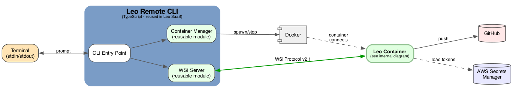
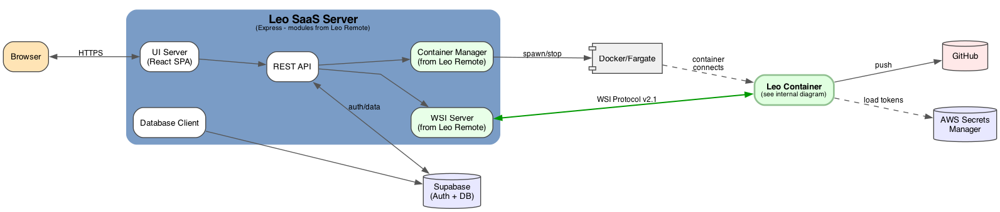

# Leo Remote & Leo SaaS Architecture

## Overview

Leo generates applications from natural language prompts using Claude Code. Two interfaces share core components:

| Interface | User | Transport | Status |
|-----------|------|-----------|--------|
| **Leo Remote** | Developer terminal | CLI spawns container locally | Building now |
| **Leo SaaS** | Browser | Web server spawns container on Fargate | Future |

## Shared Components

These modules are built once in Leo Remote, then reused verbatim in Leo SaaS:

| Component | Description | Location |
|-----------|-------------|----------|
| **Leo Container** | Docker image running WSI Client + AppGeneratorAgent | `leo-container/` |
| **Container Manager** | Spawns/stops containers (Docker locally, Fargate in prod) | `leo-saas/app/server/lib/wsi/container-manager.ts` |
| **WSI Server** | WebSocket server accepting container connections | `leo-saas/app/server/lib/wsi/wsi-server.ts` |

## Architecture Diagrams

### Leo Remote (CLI)


```
Terminal → CLI → Container Manager → Docker
                 WSI Server ←────── Container (WSI Client)
                                         ↓
                                    AppGeneratorAgent → GitHub/S3
```

### Leo SaaS (Web)


```
Browser → Express → Container Manager → Fargate
                    WSI Server ←────── Container (WSI Client)
                                            ↓
                                       AppGeneratorAgent → GitHub/S3
```

## WSI Protocol v2.1

Communication between WSI Server (CLI or SaaS) and WSI Client (Container):

```
Server → Container: start_generation, decision_response
Container → Server: ready, log, progress, decision_prompt, iteration_complete, all_work_complete
```

Full spec: [specs/wsi-protocol.md](../../specs/wsi-protocol.md)

## Container Lifecycle

1. CLI/SaaS spawns container with `WS_URL` environment variable
2. Container connects to WSI Server at `WS_URL`
3. Container sends `ready` message
4. Server sends `start_generation` with prompt
5. Container streams `log` and `progress` messages
6. Container sends `all_work_complete` when done
7. Server terminates container

## Directory Structure

```
app-factory/
├── leo-container/                    # Leo Container (Python)
│   ├── Dockerfile
│   ├── requirements.txt
│   └── src/
│       ├── main.py                   # Entry point
│       ├── leo/                      # AppGeneratorAgent (core)
│       │   ├── agents/
│       │   └── resources/            # Skills, prompts, config
│       └── runtime/                  # Container runtime
│           ├── wsi/                  # WSI Client
│           ├── managers/             # Git, artifacts
│           └── utils/                # Config, logging, secrets
├── leo-saas/                         # Leo SaaS (TypeScript)
│   └── app/
│       ├── client/                   # React frontend
│       └── server/
│           └── lib/wsi/              # WSI Server + Container Manager
├── docs/                             # This documentation
└── .claude/                          # Claude Code skills
```

## External Services

| Service | Purpose | Used By |
|---------|---------|---------|
| AWS Secrets Manager | API tokens (Claude, GitHub) | Container |
| GitHub | Generated app repositories | Container |
| AWS S3 | Generated app zip files | Container |
| Supabase | Auth + database | SaaS only |
